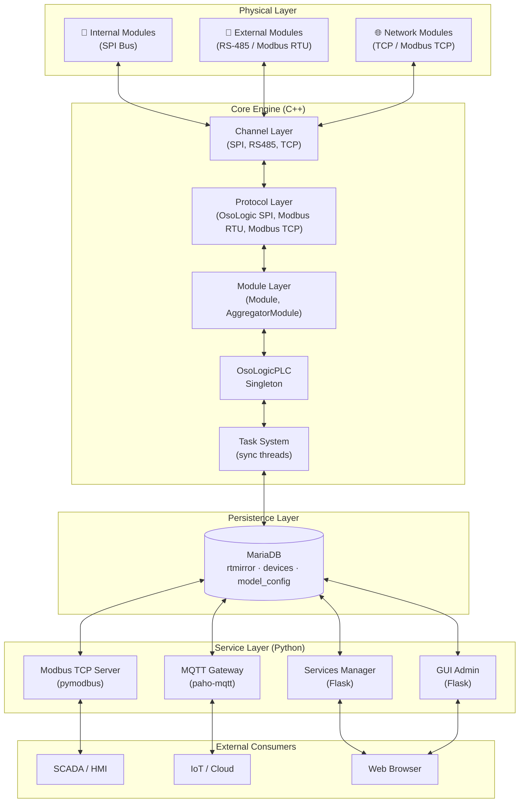
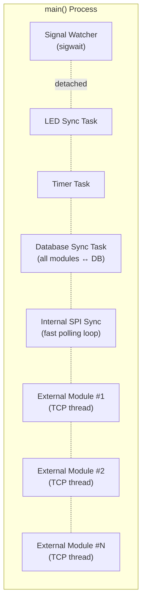
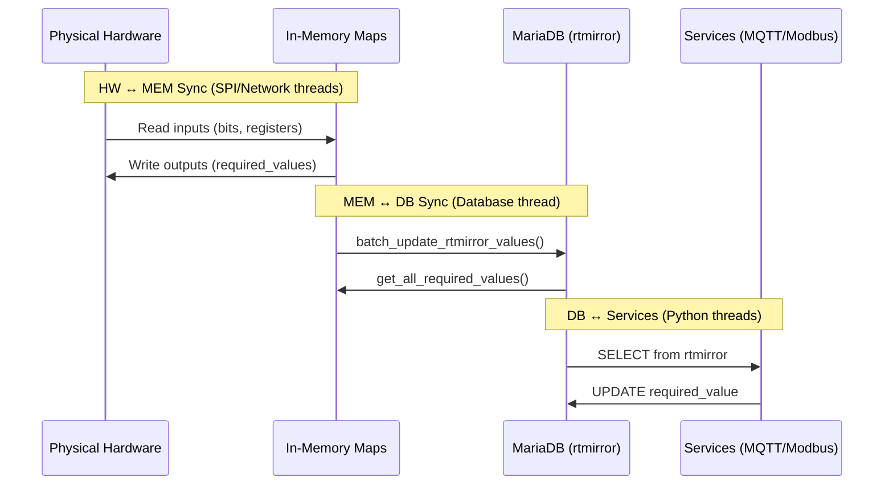

## Overview

OSOlogic PRO follows a **layered, modular architecture** that separates hardware-level real-time control (C++) from high-level network services (Python). All components synchronize state through a shared **MariaDB database** that acts as the single source of truth.

<Note>
**Where `osodb` fits.** MariaDB stays the source of truth and, at scale, the central hub — the
diagrams below are exactly right. `osodb` is an in-memory real-time **cache** layered in front of
it (think *Redis in front of MySQL*): the scan cycle and gateways get nanosecond access and keep
running through a database blip, while MariaDB keeps the truth and the SQL control surface. On a
baremetal MCU, where no database exists, the cache holds live state locally and syncs when
connected. See [`core/osodb`](https://github.com/OSOlogic/platform/tree/main/core/osodb).
</Note>



## Threading Model

The core C++ process launches multiple threads at startup. All threads inherit a blocked `SIGINT`/`SIGTERM` signal mask — a dedicated watcher thread handles shutdown via `sigwait()`.



| Thread | Purpose | Cycle |
|--------|---------|-------|
| **Signal Watcher** | Catches `SIGINT`/`SIGTERM`, prints cycle statistics, exits | Blocks on `sigwait()` |
| **LED Sync** | Refreshes front panel LEDs | Continuous loop |
| **Timer Task** | Manages internal 100ms counter | 100ms ticks |
| **Database Sync** | Writes memory → DB, reads required_values DB → memory | Continuous loop |
| **Internal SPI Sync** | Polls all internal SPI modules sequentially | Tight loop (~5-10ms) |
| **External Module (×N)** | One thread per network module (RS-485, TCP) | Continuous with timeout |

## Data Synchronization Flow

Data flows in three stages, each handled by dedicated tasks:



### Key Design Principles

<CardGroup cols={2}>
  <Card title="Shared-Nothing Between Layers" icon="layer-group">
    C++ core and Python services never communicate directly. The database is the only synchronization point, ensuring clean process isolation and crash recovery.
  </Card>
  <Card title="Composite Pattern for Modules" icon="diagram-project">
    `IModule` is implemented by both `Module` (physical) and `AggregatorModule` (virtual), allowing transparent composition of devices.
  </Card>
  <Card title="Strategy Pattern for Communication" icon="shuffle">
    `Channel` and `Protocol` interfaces allow plugging in any transport (SPI, RS-485, TCP) and protocol (OsoLogic SPI, Modbus RTU/TCP) without changing module logic.
  </Card>
  <Card title="Singleton for Global State" icon="database">
    `OsoLogicPLC` and `PLC_Database` use the Singleton pattern to ensure a single system-wide instance with thread-safe initialization.
  </Card>
</CardGroup>

## Directory Structure

```
source/
├── core/                          # C++ real-time engine
│   ├── main.cpp                   # Entry point, module factory, thread launcher
│   ├── common/                    # Shared utilities (logging, errors, debug)
│   ├── communication/
│   │   ├── channels/              # Transport layer (SPI, RS-485, TCP)
│   │   └── protocols/             # Protocol layer (Modbus, OsoLogic SPI)
│   ├── hardware/                  # Module abstractions & PLC singleton
│   ├── database/                  # MariaDB database client
│   └── tasks/                     # Thread tasks & cycle statistics
├── addons/services/               # Python microservices & interfaces
│   ├── modbustcp/server.py        # Modbus TCP server (pymodbus)
│   ├── mqtt/                      # MQTT gateway (paho-mqtt)
│   ├── services_manager/app.py    # Services manager web admin
│   ├── GUI/app.py                 # Database & I/O management GUI
│   └── node-red-interface/        # Node-RED custom automation flows
├── common/                        # Shared Python utilities
│   └── config_loader.py           # Central JSON config loader
└── config/                        # System-wide configuration
    └── config.json                # Main configuration file
```
