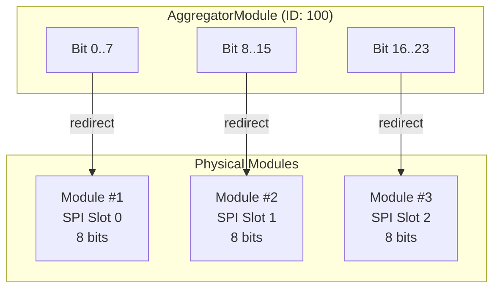
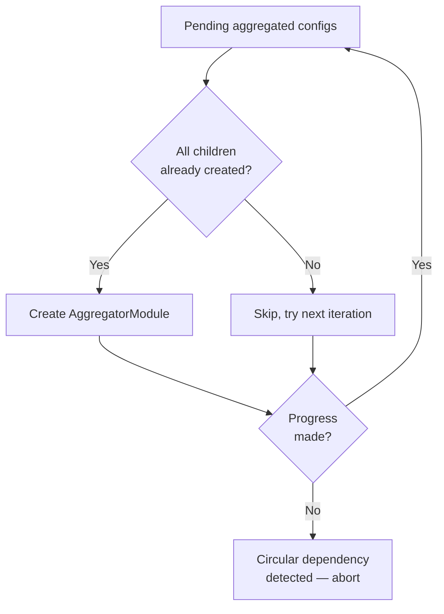

The `AggregatorModule` class implements the **Composite pattern** to create virtual devices that aggregate I/O points from multiple physical child modules. From the outside, it looks like a single `IModule`, but internally it delegates all reads and writes to the appropriate child module using a **translation map**.

## Use Case

A typical use case is a **modular PLC system** composed of multiple physical expansion modules (e.g., 3 SPI modules with 8 bits each) that should be represented as a single logical device with 24 bits to external systems (SCADA, MQTT, Modbus TCP server).



## Construction

The aggregated module is created in `main.cpp` after all physical modules have been initialized:

```cpp
auto module = std::make_shared<AggregatorModule>(
  config.module_id,       // Unique ID for the aggregated module
  config.model_id,        // Aggregated model definition
  config.module_name,     // e.g., "Machine Line A"
  config.address,         // Typically empty for aggregated
  config.channel,         // Always "aggregated"
  config.protocol,        // Always "aggregated"
  child_modules,          // vector<IModulePtr> — ordered by slot
  mappings                // vector<AggregatedMappingEntry>
);
```

### Connection String Format

The `connection_string` for aggregated modules follows the format:

```
type:child_id_1;child_id_2;child_id_3
```

For example: `aggregated:1;2;3` means children are modules with IDs 1, 2, and 3, in slot order.

## Translation Map

The core of `AggregatorModule` is the **translation map**, loaded from the `aggregated_io_map` database table. Each entry maps:

| Aggregated Side | → | Child Side |
|---|---|---|
| `logical_address` on the aggregator | | `logical_address` on the child module |
| `io_type` (bit or register) | | `io_type` on the child |
| Slot index | | Index into the `_children` vector |

```cpp
struct AggregatedMappingEntry {
  uint16_t aggregated_logical_address;
  std::string aggregated_io_type;
  uint32_t child_slot_index;
  uint16_t child_logical_address;
  std::string child_io_type;
};
```

## Redirect Pattern

All data access methods use a **redirect template**:

### Read Redirect (`_getRedirect`)

```cpp
template<typename T>
PlcErrorCodes _getRedirect(uint16_t address, T& value, const std::string& io_type) {
  // 1. Look up (address, io_type) in the translation map
  auto it = _translationMap.find({address, io_type});
  if (it == _translationMap.end())
    return ERROR_INVALID_ADDRESS;

  // 2. Get the child module from the slot index
  IModulePtr& child = _children[it->child_slot_index];

  // 3. Delegate the read to the child using its local address
  if (io_type == "bit")
    return child->getBit(it->child_logical_address, value);
  else
    return child->getRegister(it->child_logical_address, value);
}
```

### Write Redirect (`_setRedirect`)

```cpp
template<typename T>
PlcErrorCodes _setRedirect(uint16_t address, T value, const std::string& io_type) {
  auto it = _translationMap.find({address, io_type});
  if (it == _translationMap.end())
    return ERROR_INVALID_ADDRESS;

  IModulePtr& child = _children[it->child_slot_index];

  if (io_type == "bit")
    return child->setBit(it->child_logical_address, value);
  else
    return child->setRegister(it->child_logical_address, value);
}
```

<Note>
  `AggregatorModule` **never** performs hardware I/O directly. It has no `Protocol` and no `Channel`. The physical sync happens in each child's dedicated thread.
</Note>

## Sync Behavior

| Method | Behavior |
|---|---|
| `syncInputs()` | **No-op.** Children sync themselves via their own threads. |
| `syncOutputs()` | **No-op.** Required values are written through children when they execute their sync cycles. |
| `initialize()` | Validates child model IDs against `aggregated_model_children`, builds translation map, reports as connected if all children are connected. |
| `getConnected()` | Returns `1` if **all** children are connected, `0` otherwise. |

## Dependency Resolution

Aggregated modules can depend on other aggregated modules (nested composition). `main.cpp` resolves these using an **iterative loop**:



<Warning>
  If the iterative loop makes no progress in a full pass, it means there is a **circular dependency** or a missing child module. The system logs an error and skips the unresolvable modules.
</Warning>

## Reverse Map

`OsoLogicPLC::buildReverseMap()` creates a lookup from `(physical_module_id, physical_address)` → `(aggregated_module_id, aggregated_address)`. This enables the database sync task to efficiently resolve which aggregated module owns a given physical I/O point.
