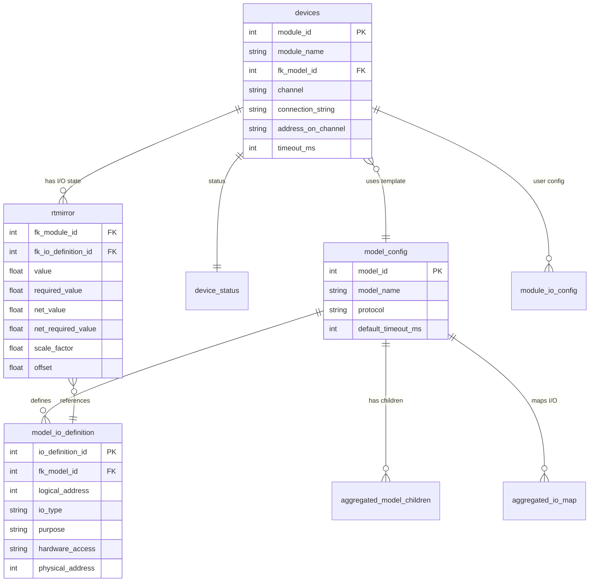
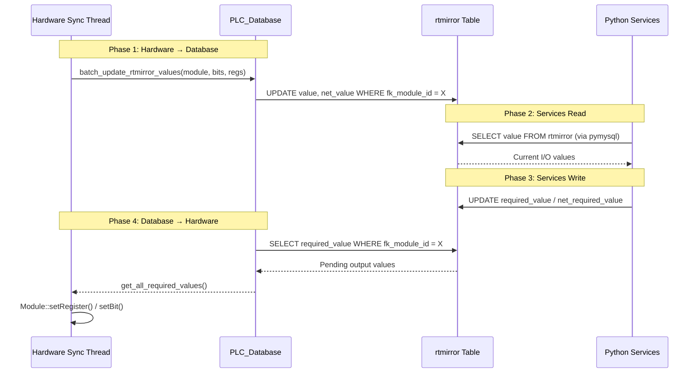

The `PLC_Database` class provides the C++ core's interface to the **MariaDB** database. It follows the Singleton pattern and handles all SQL operations needed for module configuration, I/O definition loading, and real-time state mirroring.

## Singleton Access

```cpp
std::shared_ptr<PLC_Database> database;
PlcErrorCodes rs = PLC_Database::getInstance(database);
```

The first call creates the connection using credentials from `config.json`. Subsequent calls return the same instance.

## Database Schema (Key Tables)



## Core Methods

### Configuration Loading

<ParamField path="getDeviceConfigurations(vector&lt;DeviceConfig&gt;& configs)" type="PlcErrorCodes">
  Retrieves all device configurations by joining `devices` with `model_config`. Each entry contains everything needed to construct a `Module`: IDs, channel type, protocol, connection string, address, timeout, and block sizes.
</ParamField>

<ParamField path="get_plc_config(PLC_Config& config)" type="PlcErrorCodes">
  Loads global PLC settings from `plc_settings` table: RS-485 parameters, operation mode.
</ParamField>

### I/O Definitions

<ParamField path="getIoDefinitions(uint32_t model_id, vector&lt;IoDefinition&gt;& defs)" type="PlcErrorCodes">
  Returns all I/O definitions for a given model, filtered by operation mode. Used during `Module::initialize()`.
</ParamField>

### Real-Time Mirror (rtmirror)

The `rtmirror` table is the **central synchronization point** between the C++ core and Python services.

<ParamField path="batch_update_rtmirror_values(uint32_t module_id, map bits, map registers)" type="PlcErrorCodes">
  Batch-updates `value` and `net_value` columns in `rtmirror` for a given module. Called by the database sync task after reading hardware.
  
  The `net_value` is calculated as: `net_value = (raw_value × scale_factor) + offset`
</ParamField>

<ParamField path="get_all_required_values(uint32_t module_id, map&lt;uint16_t, uint16_t&gt;& bits, map&lt;uint16_t, uint16_t&gt;& registers)" type="PlcErrorCodes">
  Reads `required_value` from `rtmirror` for all I/O points of a module. Used by the database sync task to push output changes from services back to hardware.
</ParamField>

### Aggregated Module Support

<ParamField path="getAggregatedModelChildren(uint32_t model_id, vector&lt;uint32_t&gt;& child_model_ids)" type="PlcErrorCodes">
  Returns the expected child model IDs for an aggregated model, ordered by slot index. Used for validation during aggregated module creation.
</ParamField>

<ParamField path="getAggregatedIoMap(uint32_t model_id, vector&lt;AggregatedMappingEntry&gt;& mappings)" type="PlcErrorCodes">
  Returns the I/O translation map entries for an aggregated model. Used to populate the `AggregatorModule`'s internal redirect table.
</ParamField>

### Device Status

<ParamField path="updateDeviceStatus(uint32_t module_id, bool connected, string last_seen)" type="PlcErrorCodes">
  Updates the `device_status` table with connection state and last communication timestamp.
</ParamField>

## Data Flow Through rtmirror



## Scale Factor & Offset

The `rtmirror` table supports automatic value transformation:

| Column | Direction | Formula |
|--------|-----------|---------|
| `value` | HW → DB (raw) | Direct from hardware |
| `net_value` | HW → DB (scaled) | `value × scale_factor + offset` |
| `required_value` | DB → HW (raw) | Direct to hardware |
| `net_required_value` | Services → DB | `(required_value - offset) / scale_factor` |

<Note>
  Database triggers handle the conversion between `net_required_value` and `required_value` automatically, so services write human-readable values and the core receives raw hardware values.
</Note>

## Connection Management

The database connection uses `mariadb/mysql.h` (C connector) with the following parameters:

| Setting | Value |
|---------|-------|
| Connection | TCP to `localhost` (configurable) |
| User | From `config.json` → `database.user` |
| Database | From `config.json` → `database.db_name` |
| Charset | `utf8mb4` |
| Auto-reconnect | Enabled |
