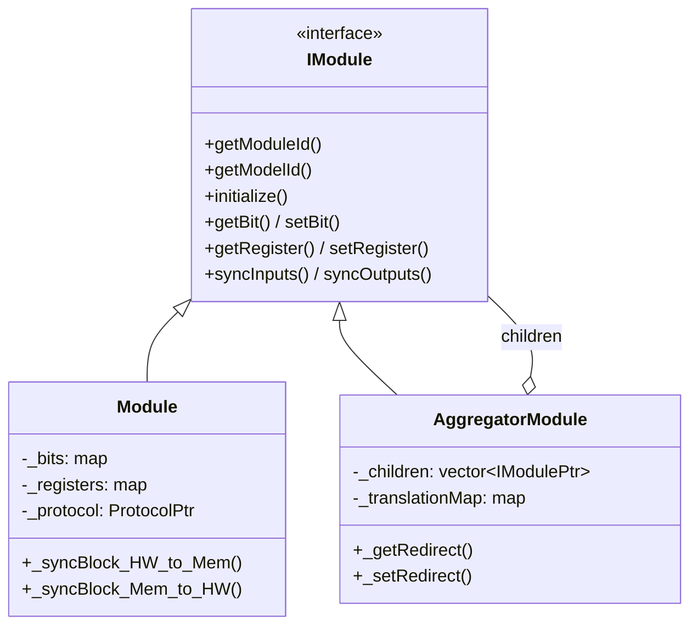

The `IModule.hpp` file defines the **fundamental interface** that every PLC module must implement. It uses the **Composite pattern**: both physical modules (`Module`) and virtual aggregated modules (`AggregatorModule`) share this same API, making them interchangeable throughout the system.

## Key Data Structures

### IoDefinition

Represents a single I/O point as defined in the database (`model_io_definition` table):

```cpp
struct IoDefinition {
  uint32_t io_definition_id;   // Primary key from DB
  uint32_t fk_model_id;        // Foreign key to model_config
  uint16_t logical_address;    // Address exposed to protocols (0, 1, 2, ...)
  std::string io_type;         // "bit" or "register"
  std::string purpose;         // "standard", "secure_state", or "config"
  std::string hardware_access; // "readonly" or "readwrite"
  uint16_t physical_address;   // Actual address on the physical device
  std::string access_method;   // "direct" or "bitmask"
  uint8_t bitmask_offset;      // Bit offset within a register (0–15)
  uint8_t register_count;      // Number of 16-bit registers (1–4)
  std::string endianess;       // "big" or "little"
  std::string default_io_label;
};
```

### IO_Block

Defines a contiguous range for block read/write operations:

```cpp
struct IO_Block {
  uint16_t startAddress;   // First address in the block
  uint16_t quantity;       // Number of consecutive addresses
};
```

<Note>
The `IO_Block` structure is used to split large I/O ranges into smaller chunks that fit within the device's maximum block size (e.g., Modbus PDU limits of ~120 registers).
</Note>

## Interface Methods

### Identity & Configuration

<ParamField path="getModuleId(uint32_t& id)" type="PlcErrorCodes">
  Returns the unique module ID (primary key from the `devices` table).
</ParamField>

<ParamField path="getModelId(uint32_t& id)" type="PlcErrorCodes">
  Returns the model ID (foreign key to `model_config`). Used for validation and aggregated module dependency resolution.
</ParamField>

<ParamField path="getChannel(std::string& channel)" type="PlcErrorCodes">
  Returns the channel type string: `"spi"`, `"rs485"`, `"tcp"`, or `"aggregated"`.
</ParamField>

<ParamField path="getProtocol(std::string& protocol)" type="PlcErrorCodes">
  Returns the protocol string: `"osologic-spi"`, `"modbus-rtu"`, `"modbus-tcp"`, or `"aggregated"`.
</ParamField>

### Lifecycle

<ParamField path="initialize()" type="PlcErrorCodes">
  Loads I/O definitions from the database, creates internal data structures (bit/register maps), and establishes the connection with the physical device. Must be called before any data operations.
</ParamField>

### Connection State

<ParamField path="getConnected(uint8_t& connected)" type="PlcErrorCodes">
  Returns `1` if the module is responding to communication, `0` otherwise. Updated automatically during hardware sync cycles.
</ParamField>

<ParamField path="setConnected(uint8_t connected)" type="PlcErrorCodes">
  Manually sets the connection status. Called by the sync tasks when a module starts or stops responding.
</ParamField>

### Data Access — Bits

<ParamField path="getBit(uint16_t address, uint8_t& value)" type="PlcErrorCodes">
  Reads a single bit value from the in-memory mirror.
</ParamField>

<ParamField path="setBit(uint16_t address, uint8_t value)" type="PlcErrorCodes">
  Writes a bit value to the **required_value** buffer. The change will be pushed to hardware on the next sync cycle.
</ParamField>

<ParamField path="getAllBits(std::map&lt;uint16_t, uint8_t&gt;& bits)" type="PlcErrorCodes">
  Returns all bit values as an address→value map. Used by the database sync task.
</ParamField>

### Data Access — Registers

<ParamField path="getRegister(uint16_t address, uint16_t& value)" type="PlcErrorCodes">
  Reads a single 16-bit register value from the in-memory mirror.
</ParamField>

<ParamField path="setRegister(uint16_t address, uint16_t value)" type="PlcErrorCodes">
  Writes a register value to the **required_value** buffer.
</ParamField>

<ParamField path="getAllRegisters(std::map&lt;uint16_t, uint16_t&gt;& registers)" type="PlcErrorCodes">
  Returns all register values as an address→value map.
</ParamField>

### Synchronization

<ParamField path="syncInputs()" type="PlcErrorCodes">
  Reads all I/O data from physical hardware into the in-memory maps. Called by hardware sync threads.
</ParamField>

<ParamField path="syncOutputs()" type="PlcErrorCodes">
  Writes all pending `required_values` from memory to physical hardware. Called by hardware sync threads.
</ParamField>

### Metadata

<ParamField path="getAllIoDefinitions(std::vector&lt;IoDefinition&gt;& definitions)" type="PlcErrorCodes">
  Returns the complete list of I/O point definitions loaded from the database during `initialize()`.
</ParamField>

<ParamField path="getModuleInfo(ModuleInfoResponse& info)" type="PlcErrorCodes">
  Queries the physical device for its self-reported identity (model ID, firmware version). Used for initial validation during `initialize()`.
</ParamField>

## Thread Safety

All `IModule` methods that access internal data are protected by a `std::recursive_mutex`. This allows:

- Multiple sync threads to safely read/write the same module
- Nested calls (e.g., `AggregatorModule` calling `getBit()` on child modules within its own locked context)

```cpp
// Typical pattern inside Module
PlcErrorCodes Module::getBit(uint16_t address, uint8_t& value) {
  std::lock_guard<std::recursive_mutex> lock(_mutex);
  auto it = _bits.find(address);
  if (it == _bits.end()) return ERROR_INVALID_ADDRESS;
  value = it->second.value;
  return PLC_SUCCESS;
}
```

## Class Hierarchy


