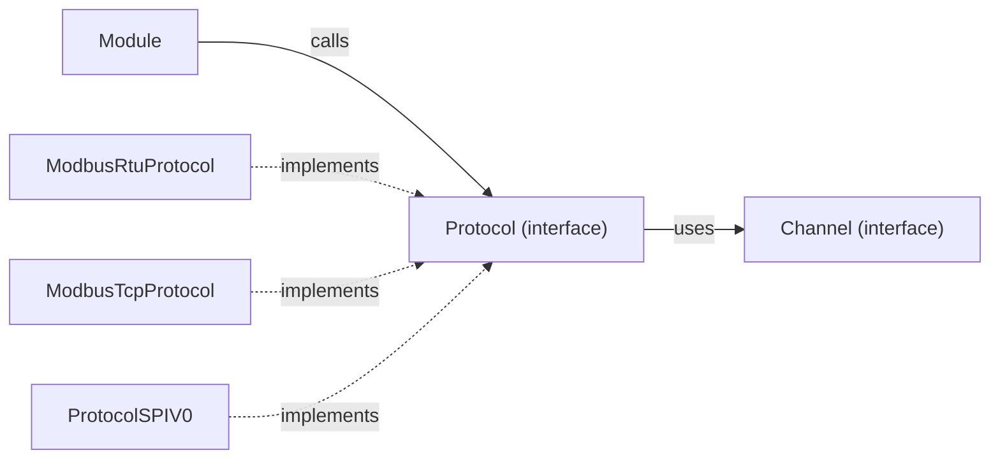

The `Iprotocol.hpp` file defines the abstract `Protocol` interface that all communication protocol implementations must inherit from. This layer sits **above** the `Channel` layer and translates high-level I/O operations (read bits, write registers) into protocol-specific wire formats.

## Class Definition

```cpp
#include <memory>
#include <cstdint>
#include <mutex>
#include "PlcErrorCodes.hpp"

class Protocol {
public:
  virtual ~Protocol() = default;

  // --- Read Operations ---
  virtual PlcErrorCodes readBits(
    const std::string& address,
    uint16_t startAddress,
    uint16_t quantity,
    uint8_t* buffer
  ) = 0;

  virtual PlcErrorCodes readRegisters(
    const std::string& address,
    uint16_t startAddress,
    uint16_t quantity,
    uint16_t* buffer
  ) = 0;

  // --- Write Operations ---
  virtual PlcErrorCodes writeBits(
    const std::string& address,
    uint16_t startAddress,
    uint16_t quantity,
    const uint8_t* buffer
  ) = 0;

  virtual PlcErrorCodes writeRegisters(
    const std::string& address,
    uint16_t startAddress,
    uint16_t quantity,
    const uint16_t* buffer
  ) = 0;

  // --- Connection Management ---
  virtual PlcErrorCodes connect(const std::string& address) = 0;
  virtual PlcErrorCodes disconnect(const std::string& address) = 0;
  virtual PlcErrorCodes isConnected(const std::string& address, bool& connected) = 0;
};

using ProtocolPtr = std::shared_ptr<Protocol>;
```

## Methods

### Read Operations

<ParamField path="readBits" type="PlcErrorCodes">
  Reads a contiguous block of discrete inputs (bits) from a remote device.
  - `address`: Device identifier on the channel (e.g., slave address for Modbus, slot for SPI).
  - `startAddress`: Logical start address of the first bit.
  - `quantity`: Number of bits to read.
  - `buffer`: Output buffer for the read values (one byte per bit, 0 or 1).
</ParamField>

<ParamField path="readRegisters" type="PlcErrorCodes">
  Reads a contiguous block of 16-bit registers from a remote device.
  - `address`: Device identifier on the channel.
  - `startAddress`: Logical start address of the first register.
  - `quantity`: Number of registers to read.
  - `buffer`: Output buffer for the read 16-bit values.
</ParamField>

### Write Operations

<ParamField path="writeBits" type="PlcErrorCodes">
  Writes a contiguous block of discrete outputs (bits) to a remote device.
  - `address`: Device identifier on the channel.
  - `startAddress`: Logical start address.
  - `quantity`: Number of bits to write.
  - `buffer`: Input buffer with the values to write (one byte per bit).
</ParamField>

<ParamField path="writeRegisters" type="PlcErrorCodes">
  Writes a contiguous block of 16-bit registers to a remote device.
  - `address`: Device identifier on the channel.
  - `startAddress`: Logical start address.
  - `quantity`: Number of registers to write.
  - `buffer`: Input buffer with 16-bit values to write.
</ParamField>

### Connection Management

<ParamField path="connect" type="PlcErrorCodes">
  Establishes a protocol-level connection with the device at the given address. For SPI, this calls `start()` on the channel. For Modbus TCP, this opens the TCP socket.
</ParamField>

<ParamField path="disconnect" type="PlcErrorCodes">
  Terminates the protocol-level connection and releases associated resources.
</ParamField>

<ParamField path="isConnected" type="PlcErrorCodes">
  Checks whether the device at the given address is currently reachable.
  - `connected`: (Reference) Set to `true` if connected, `false` otherwise.
</ParamField>

## Concrete Implementations

| Implementation | Channel | Protocol | File | Description |
|---|---|---|---|---|
| `ProtocolSPIV0` | `SPI_Channel` | OsoLogic OsoLogic SPI | `spi/spi_protocol.hpp` | Proprietary GPIO-based SPI protocol for internal expansion modules. Uses slot-based addressing. |
| `ModbusRtuProtocol` | `RS485_Channel` or `TCP_Channel` | Modbus RTU | `modbus/modbus_rtu_protocol.hpp` | Standard Modbus RTU frame format with CRC-16. Supports shared bus with mutex arbitration. |
| `ModbusTcpProtocol` | `TCP_Channel` | Modbus TCP/IP | `modbus/modbus_tcp_protocol.hpp` | Standard Modbus TCP with MBAP header. One TCP connection per module. |

## Bus Mutex Arbitration

For shared buses (RS-485, SPI), multiple modules may share the same physical channel. The protocol layer accepts a `std::shared_ptr<std::mutex>` at construction time to serialize access:

```cpp
// In main.cpp — channel deduplication and mutex sharing
auto bus_mutex = std::make_shared<std::mutex>();

// All modules on the same bus share the mutex
auto protocol = std::make_shared<ModbusRtuProtocol>(
  channel,      // Shared RS485_Channel
  bus_mutex,     // Shared mutex for this physical bus
  config.timeout_ms
);
```

<Note>
  Each protocol implementation locks the bus mutex **before** writing a request frame and releases it **after** reading the complete response. This ensures atomic request-response pairs on half-duplex buses.
</Note>

## Relationship to Other Components


