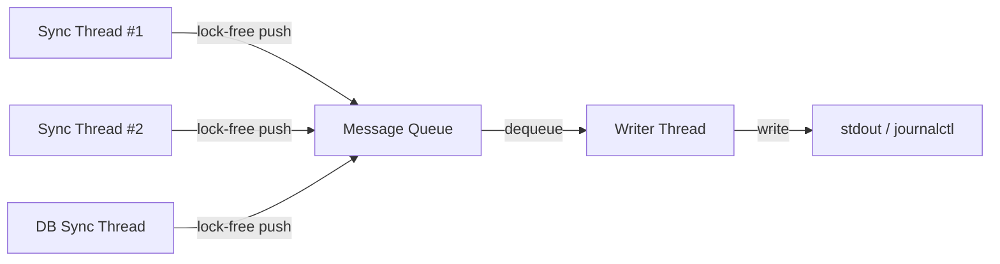

The core provides a **multi-level logging system** designed for real-time embedded use: a lock-free async logger for production, and conditional compile-time macros for debug and trace output.

## AsyncLogger

The `AsyncLogger` class provides **thread-safe, non-blocking logging** using a dedicated writer thread. Log messages are pushed into a queue and flushed to stdout asynchronously, ensuring that logging calls never block the real-time sync threads.

### Lifecycle

```cpp
// Start the logger thread (call once, before any logging)
AsyncLogger::start();

// Log messages from any thread
log_msg("[INFO] Module initialized");
log_error("context", "Something failed", errorCode);

// Stop and flush (call at shutdown)
AsyncLogger::stop();
```

### API

<ParamField path="AsyncLogger::start()" type="void">
  Spawns the background writer thread that dequeues messages and writes them to stdout. Must be called **before** any `log_msg()` or `log_error()` call.
</ParamField>

<ParamField path="AsyncLogger::stop()" type="void">
  Signals the writer thread to flush all remaining messages and exit. Called during shutdown.
</ParamField>

<ParamField path="log_msg(const std::string& message)" type="void">
  Enqueues a message for asynchronous output. Adds a timestamp prefix automatically.
</ParamField>

<ParamField path="log_error(const std::string& context, const std::string& message, PlcErrorCodes code)" type="void">
  Enqueues an error message with context, description, and error code.
</ParamField>

### Design



<Note>
  The async logger ensures that high-frequency sync threads (especially the SPI loop running at ~5ms cycles) are never blocked by I/O operations. Messages are batched and flushed efficiently by the writer thread.
</Note>

## Conditional Debug Macros

The `debug.hpp` file defines compile-time macros that are activated based on the build mode:

### DEBUG_STREAM

Available when compiled with `make debug` (adds `-DDEBUG` flag).

```cpp
DEBUG_STREAM("Cycle time: " << elapsed << " us. Module: " << module_id);
```

**Output:**
```
[2026-01-15 10:23:45.123456] [DEBUG] Cycle time: 5.2 us. Module: 3
```

Use for:
- Timing measurements
- State transitions
- Configuration loading details
- Connection status changes

### TRACE_STREAM

Available when compiled with `make trace` (adds `-DTRACE` flag).

```cpp
TRACE_STREAM("[HW->MEM] Module " << id << " bit " << addr << ": " << old_val << " -> " << new_val);
```

**Output:**
```
[2026-01-15 10:23:45.123456789] [TRACE] [HW->MEM] Module 1 bit 5: 0 -> 1
```

Use for:
- Individual I/O value changes
- Data flow traceability
- High-resolution timestamps for protocol debugging

### Build Modes Summary

| Command | Flag | `log_msg` | `DEBUG_STREAM` | `TRACE_STREAM` |
|---------|------|-----------|----------------|-----------------|
| `make` | — | ✅ Active | ❌ Compiled out | ❌ Compiled out |
| `make debug` | `-DDEBUG` | ✅ Active | ✅ Active | ❌ Compiled out |
| `make trace` | `-DTRACE` | ✅ Active | ❌ Compiled out | ✅ Active |

<Warning>
  **Never run `make trace` in production.** Trace mode logs every individual I/O value change, which can generate thousands of lines per second and significantly impact performance.
</Warning>

## Macro Implementation

Both macros use a `do { ... } while(0)` pattern for safe expansion and route output through the async logger:

```cpp
#ifdef DEBUG
#define DEBUG_STREAM(stream_expr)                                \
  do {                                                           \
    std::stringstream _ss;                                       \
    _ss << "[" << get_timestamp() << "] [DEBUG] " << stream_expr;\
    log_msg(_ss.str());                                          \
  } while (0)
#else
#define DEBUG_STREAM(stream_expr) ((void)0)  // Zero overhead
#endif
```

When the macro is not active, it compiles to `((void)0)` — the compiler completely eliminates any evaluation of the stream expression, ensuring **zero runtime overhead** in production builds.

## Integration with systemd

When the PLC core runs as a `systemd` service, all stdout output (from `AsyncLogger`) is captured by `journalctl`:

```bash
# View live logs for the PLC core service
journalctl -u plc_osologic-core -f

# View last 200 lines
journalctl -u plc_osologic-core -n 200 --no-pager
```

The Services Manager web UI also displays these logs through its log viewer modal.
