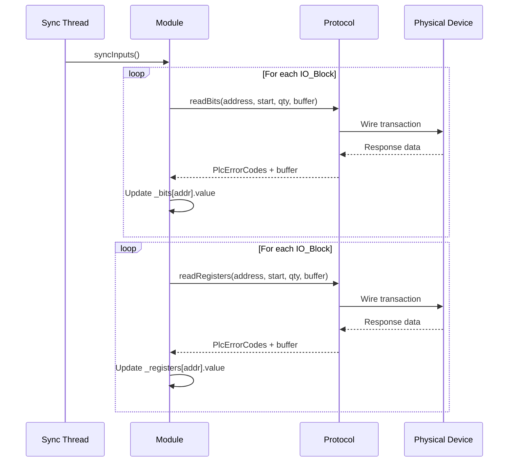
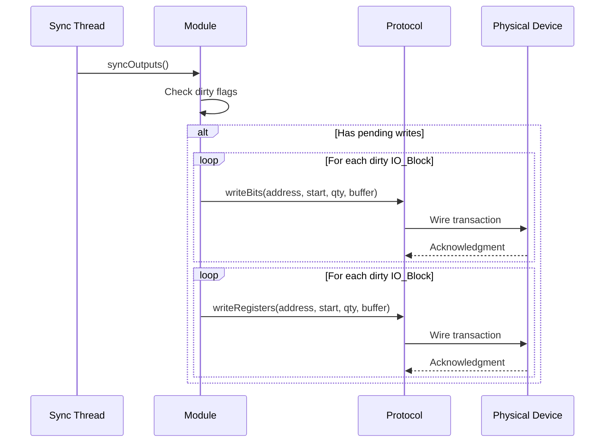

The `Module` class is the concrete implementation of `IModule` for **physical hardware devices**. It manages the real-time synchronization between the in-memory data maps and the actual hardware through a `Protocol` instance.

## Construction

A `Module` is created in `main.cpp` with the following parameters:

```cpp
auto module = std::make_shared<Module>(
  config.module_id,                    // Unique ID from DB
  config.model_id,                     // Model template ID
  config.module_name,                  // Human-readable name
  config.address,                      // Address on channel (e.g., "1" for Modbus slave)
  config.max_read_bit_block_size,      // Max bits per read PDU
  config.max_read_register_block_size, // Max registers per read PDU
  config.max_write_bit_block_size,     // Max bits per write PDU
  config.max_write_register_block_size,// Max registers per write PDU
  config.channel,                      // "spi", "rs485", "tcp"
  config.protocol,                     // "osologic-spi", "modbus-rtu", "modbus-tcp"
  protocol_handler                     // Shared ProtocolPtr
);
```

## Internal Data Units

The module stores I/O state using two data unit types:

```cpp
struct bitUnit {
  uint8_t value;           // Current hardware value (0 or 1)
  uint8_t required_value;  // Desired output value (set by DB sync or API)
};

struct registerUnit {
  uint16_t value;           // Current hardware value (16-bit)
  uint16_t required_value;  // Desired output value
};
```

All units are stored in `std::map` containers indexed by **logical address**:

```cpp
std::map<uint16_t, bitUnit>      _bits;
std::map<uint16_t, registerUnit> _registers;
```

## Initialization Flow

When `initialize()` is called:

<Steps>
  <Step title="Load I/O Definitions">
    Queries `model_io_definition` from the database via `PLC_Database`. Filters by `purpose` based on the current operation mode (`EXECUTION` → `standard` only; `CONFIGURATION` → `secure_state` + `config`).
  </Step>
  <Step title="Create Data Maps">
    Creates `bitUnit` and `registerUnit` entries in `_bits` and `_registers` for each matching `IoDefinition`.
  </Step>
  <Step title="Device Identification">
    Calls `getModuleInfo()` via the protocol to verify the physical device matches the expected model. If the reported `model_id` differs from the configured one, the module logs a warning but continues operation.
  </Step>
  <Step title="Compute Sync Blocks">
    Splits the I/O address ranges into `IO_Block` chunks that respect the device's maximum PDU size. Stored as `_readBitBlocks`, `_readRegisterBlocks`, etc.
  </Step>
</Steps>

## Hardware Synchronization

The sync cycle is the core loop that keeps hardware and memory in sync. It runs in the module's dedicated thread.

### Read: Hardware → Memory



### Write: Memory → Hardware



### Block Splitting

Large address ranges are split to respect protocol limits. For example, a device with 256 registers and `max_read_register_block_size = 16` will produce 16 `IO_Block` entries:

```
Block[0]: { start: 0, qty: 16 }
Block[1]: { start: 16, qty: 16 }
...
Block[15]: { start: 240, qty: 16 }
```

<Warning>
  Non-contiguous addresses (e.g., addresses 0, 5, 100, 200) are handled correctly. The block computation only groups **consecutive** addresses, never gaps.
</Warning>

## Connection Management

The module automatically detects device disconnections:

- If a `readBits()` or `readRegisters()` call returns an error, the module decrements an internal retry counter.
- After consecutive failures, it marks itself as **disconnected** (`setConnected(0)`).
- On the next successful operation, it marks itself as **connected** again.
- The database sync task persists connection status to the `device_status` table.

## Secure State Mode

When the PLC operates in `CONFIGURATION` mode, only I/O points with `purpose = 'secure_state'` or `purpose = 'config'` are active. This allows safe reconfiguration while the machine maintains a known-safe output state.

## Key Methods Summary

| Method | Thread | Description |
|--------|--------|-------------|
| `initialize()` | Main | Loads IO defs, creates maps, verifies device identity |
| `syncInputs()` | HW Sync | Reads all inputs from hardware into memory |
| `syncOutputs()` | HW Sync | Writes pending outputs from memory to hardware |
| `getBit()` / `getRegister()` | Any | Thread-safe read from in-memory mirror |
| `setBit()` / `setRegister()` | DB Sync | Sets required_value for next write cycle |
| `getModuleInfo()` | Main | Queries device identity via protocol |
