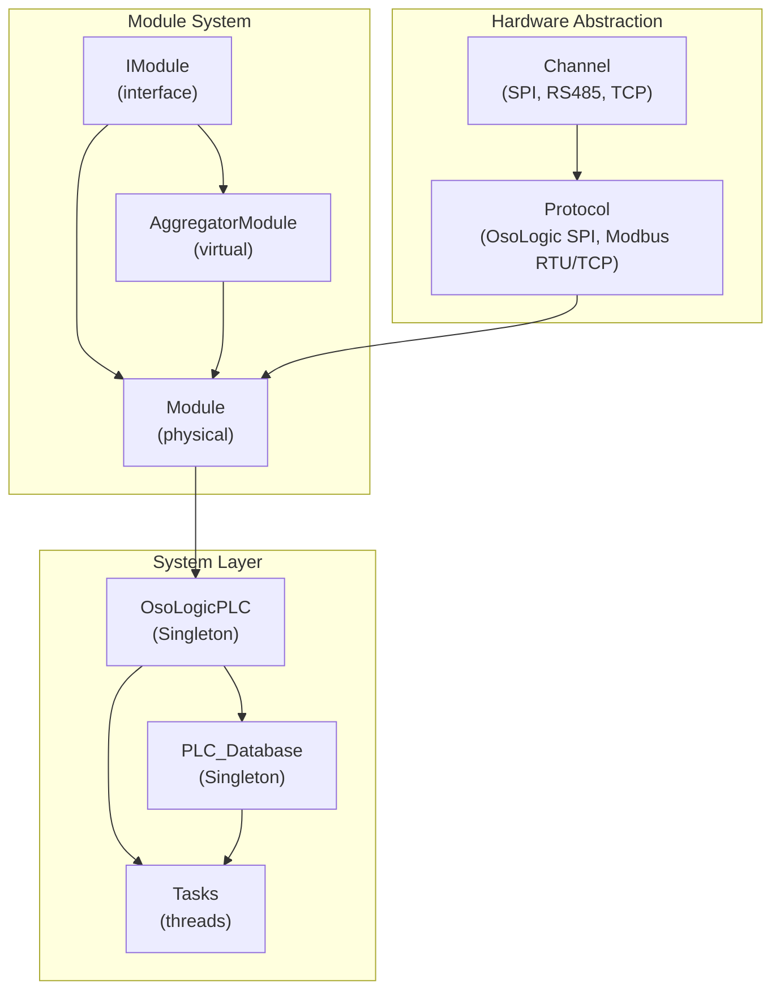

## Introduction

The **Core Engine** is the heart of OSOlogic — part of the open **Community Edition** (AGPL-3.0); the RT mechanism itself is open, only validated/specialized deterministic add-ons are Enterprise. Written in C++17, it runs as a single process with multiple threads on a Linux-based embedded system (Raspberry Pi / ARM). It is responsible for:

- Direct hardware communication via SPI, RS-485, and TCP channels
- Real-time synchronization between physical I/O and in-memory state
- Persistent state mirroring to MariaDB
- Signal-safe shutdown with cycle statistics reporting

## Design Patterns

The core uses four key software patterns:

| Pattern | Where | Purpose |
|---------|-------|---------|
| **Strategy** | `Channel`, `Protocol` | Swap transport/protocol implementations without changing modules |
| **Composite** | `IModule` → `Module` + `AggregatorModule` | Treat physical and virtual devices uniformly |
| **Singleton** | `OsoLogicPLC`, `PLC_Database`, `Leds` | Ensure exactly one global instance with thread-safe access |
| **Template Method** | `Module::_syncBlock_HW_to_Mem` | Define sync skeleton; subclasses fill in protocol calls |

## Component Map



## Build Modes

The core supports three compilation modes that activate different levels of logging:

<CardGroup cols={3}>
  <Card title="Release" icon="rocket">
    ```bash
    make
    ```
    No debug output. Optimized for production. **CycleStats are disabled** to ensure maximum performance.
  </Card>
  <Card title="Debug" icon="bug">
    ```bash
    make debug
    ```
    Enables `DEBUG_STREAM()` macros. **Records cycle stats** and prints them in real-time for every cycle. Shows final report on shutdown.
  </Card>
  <Card title="Trace" icon="magnifying-glass">
    ```bash
    make trace
    ```
    Enables `TRACE_STREAM()` macros. **Records cycle stats** in the background (no per-cycle print) and shows the final report on shutdown.
  </Card>
</CardGroup>

## Startup Sequence

The `main()` function orchestrates initialization in strict order:

<Steps>
  <Step title="Signal Setup">
    Block `SIGINT`/`SIGTERM` in the main thread (inherited by all children). Launch a dedicated watcher thread that calls `sigwait()`.
  </Step>
  <Step title="GPIO & Peripherals">
    Initialize WiringPi GPIO. Start LED sync and timer threads.
  </Step>
  <Step title="Database Connection">
    Connect to MariaDB via `PLC_Database::getInstance()`. Load device configurations and PLC settings (`operation_mode`, `rs485_baudrate`, etc.).
  </Step>
  <Step title="Channel & Protocol Creation">
    For each device config, create or reuse the appropriate `Channel` and `Protocol`. Channels are deduplicated by `(channel_type, connection_string)` key.
  </Step>
  <Step title="Module Instantiation">
    Create `Module` instances for physical devices first. Then resolve `AggregatorModule` dependencies iteratively, detecting circular dependencies.
  </Step>
  <Step title="Initialization">
    Call `initialize()` on all physical modules, then on aggregated modules. Build the reverse map for aggregated→physical resolution.
  </Step>
  <Step title="Thread Launch">
    Launch one database sync thread, one internal SPI sync thread (if SPI modules exist), and one thread per external network module.
  </Step>
</Steps>

## Next Steps

Explore each component in detail:

<CardGroup cols={2}>
  <Card title="Channel Interface" icon="plug" href="/developers/core/ichannel">
    Low-level transport abstraction (SPI, RS-485, TCP)
  </Card>
  <Card title="Protocol Interface" icon="code" href="/developers/core/iprotocol">
    Protocol abstraction (Modbus, OsoLogic SPI)
  </Card>
  <Card title="Module Interface" icon="cube" href="/developers/core/imodule">
    Core data access API for all PLC modules
  </Card>
  <Card title="Task System" icon="gears" href="/developers/core/tasks">
    Threading model, cycle statistics, signal handling
  </Card>
</CardGroup>
