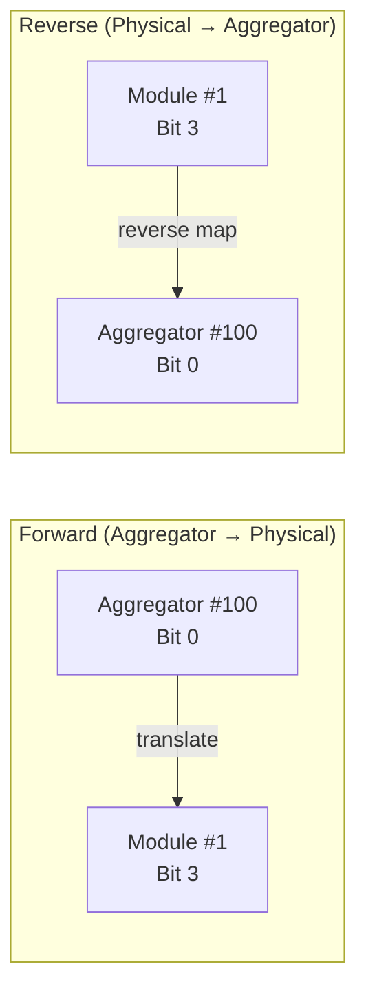
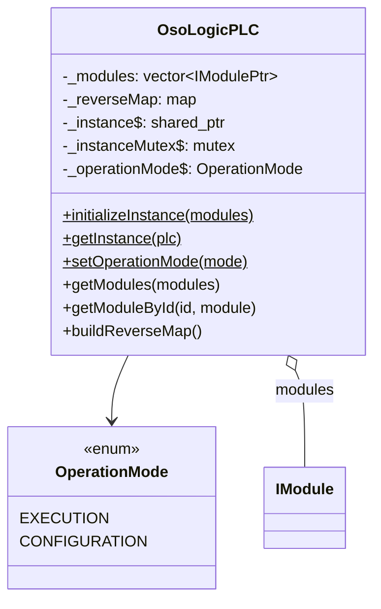

The `OsoLogicPLC` class is the **top-level singleton** that holds all instantiated modules and provides system-wide configuration. It is the single entry point for accessing the full module tree.

## Singleton Pattern

```cpp
// Initialization (called once in main.cpp)
PlcErrorCodes rs = OsoLogicPLC::initializeInstance(created_modules);

// Access from any thread
OsoLogicPLCPtr plc;
PlcErrorCodes rs = OsoLogicPLC::getInstance(plc);
```

<Warning>
  `initializeInstance()` must be called **before** `getInstance()`. Calling `getInstance()` before initialization returns `ERROR_PLC_NOT_INITIALIZED`.
</Warning>

## Operation Modes

The PLC supports two operation modes, stored in the `plc_settings` database table:

| Mode | Enum | I/O Points Loaded | Purpose |
|------|------|--------------------|---------|
| **Execution** | `OperationMode::EXECUTION` | `purpose = 'standard'` | Normal operation — process control |
| **Configuration** | `OperationMode::CONFIGURATION` | `purpose IN ('secure_state', 'config')` | Safe reconfiguration while maintaining known-safe outputs |

```cpp
// Set globally before module initialization
rs = OsoLogicPLC::setOperationMode(plc_config.operation_mode);
```

The operation mode is **static** — it applies to all modules system-wide and determines which `IoDefinition` entries are loaded during `Module::initialize()`.

## Module Management

### Module Storage

All modules (physical and aggregated) are stored in a flat vector:

```cpp
class OsoLogicPLC {
private:
  std::vector<IModulePtr> _modules;
  static std::shared_ptr<OsoLogicPLC> _instance;
  static std::mutex _instanceMutex;
  static OperationMode _operationMode;
};
```

### Module Lookup

<ParamField path="getModules(vector&lt;IModulePtr&gt;& modules)" type="PlcErrorCodes">
  Returns all registered modules (both physical and aggregated).
</ParamField>

<ParamField path="getModuleById(uint32_t id, IModulePtr& module)" type="PlcErrorCodes">
  Finds a specific module by its unique ID. Returns `ERROR_MODULE_NOT_FOUND` if not present.
</ParamField>

## Reverse Map

The reverse map is a critical data structure for the **database sync task**. It maps physical module I/O points back to their aggregated parent:



### Why It's Needed

When the database sync task reads `required_values` from the `rtmirror` table, it gets values keyed by `(module_id, logical_address)`. For aggregated modules, the sync task needs to know which physical child to actually write the value to.

### Build Process

```cpp
// Called once after all modules are created and initialized
plc->buildReverseMap();
```

The reverse map is built by iterating over all `AggregatorModule` instances and inverting their translation maps:

```
For each AggregatorModule:
  For each entry in translationMap:
    reverseMap[(child_module_id, child_address)] = (aggregator_id, aggregated_address)
```

## PLC_Config

Global PLC settings loaded from the `plc_settings` table:

```cpp
struct PLC_Config {
  uint32_t rs485_baudrate;     // Default: 19200
  char     rs485_parity;       // 'N', 'E', or 'O'
  uint8_t  rs485_bit_stop;     // 1 or 2
  uint8_t  rs485_data_bits;    // 7 or 8
  OperationMode operation_mode; // EXECUTION or CONFIGURATION
};
```

These values are read once at startup and used to configure RS-485 channels.

## Class Diagram


