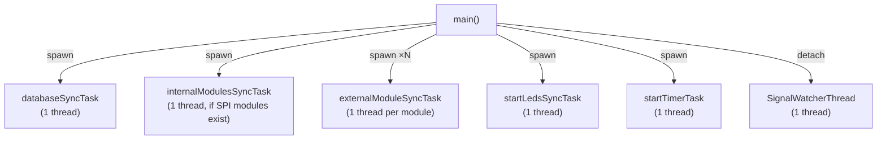
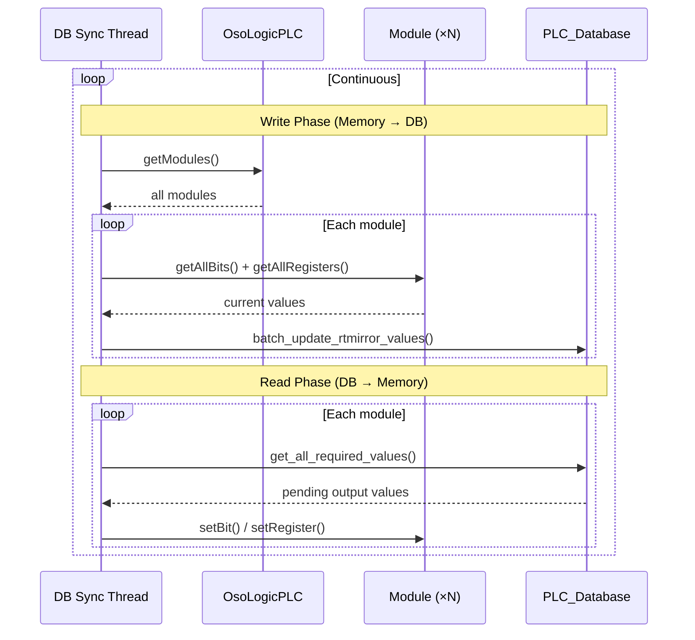

The `tasks.hpp` file defines the thread functions that drive the PLC's real-time operation. Each task runs as a dedicated `std::thread`, launched from `main()` after module initialization.

## Thread Architecture



## Sync Tasks

### Internal SPI Sync

```cpp
void internalModulesSyncTask(std::vector<IModulePtr> internal_modules);
```

Handles all **internal SPI modules** in a single tight loop. Because the SPI bus is a shared resource with mutex arbitration, polling all SPI modules sequentially in one thread is more efficient than using separate threads.

**Cycle:**
1. For each module: `syncInputs()` → read bits & registers from SPI
2. For each module: `syncOutputs()` → write pending required_values to SPI
3. Record cycle time in `g_stats_hw_internal`
4. Repeat immediately (no sleep — aims for ~5-10ms cycle time)

### External Module Sync

```cpp
void externalModuleSyncTask(IModulePtr module);
```

Each external module (RS-485, TCP, Modbus RTU, Modbus TCP) gets its **own dedicated thread**. This isolation ensures that a slow or unresponsive network module doesn't block other modules.

**Cycle:**
1. `syncInputs()` — read from network device
2. `syncOutputs()` — write pending values
3. Record cycle time in `g_stats_hw_external` (per-module)
4. Handle timeout/disconnection errors gracefully
5. Repeat immediately

<Note>
  The thread handles connection errors internally. If a module is unreachable, the thread continues retrying (with increasing backoff) without affecting other modules.
</Note>

### Database Sync

```cpp
void databaseSyncTask(OsoLogicPLCPtr plc);
```

A single thread manages the bidirectional sync between in-memory module state and the MariaDB database.

**Cycle:**
1. **Write phase:** For each module, call `batch_update_rtmirror_values()` with current bit/register values
2. **Read phase:** For each module, call `get_all_required_values()` and apply to module via `setBit()`/`setRegister()`
3. **Status phase:** Update `device_status` table with connection state and timestamp
4. Record cycle time in `g_stats_database`
5. Short sleep to limit DB load



### LED Sync

```cpp
std::thread startLedsSyncTask();
```

Manages the front panel LEDs. Uses the `Leds` singleton to refresh LED state (blink counters, status indicators). The green LED indicates system health; the red LED indicates errors.

### Timer Task

```cpp
std::thread startTimerTask();
```

A 100ms tick counter used by the core for timing-dependent operations. Provides a low-resolution system clock independent of wall time.

## Cycle Statistics

The `CycleStats` class records timing information for performance monitoring. To minimize overhead, **recording is only active in `Debug` and `Trace` build modes**. In `Release` mode, these operations are compiled out.

```cpp
class CycleStats {
public:
  void record(double cycle_time_us);
  void print(const std::string& label) const;
  void printAll() const; // For per-module stats

  double min_us;
  double max_us;
  double avg_us;
  uint64_t count;
};
```

### Global Statistics Instances

| Variable | Source | Description |
|----------|--------|-------------|
| `g_stats_hw_internal` | `internalModulesSyncTask` | SPI bus polling cycle time |
| `g_stats_hw_external` | `externalModuleSyncTask` | Per-module network sync time (map of module_id → CycleStats) |
| `g_stats_database` | `databaseSyncTask` | Database round-trip time |

### Viewing Statistics

Statistics are only collected and printed if the core was compiled with `make debug` or `make trace`. 

- **In Debug mode**: Stats are printed to the log in real-time after every cycle, and a final report is shown on shutdown.
- **In Trace mode**: Stats are recorded silently and only the final report is shown on shutdown.

Final reports are printed to stdout when the process receives `SIGINT` or `SIGTERM`:

```
================================================
 CYCLE TIME STATISTICS (signal 2 — final report)
================================================
Hardware Sync  — internal SPI modules
  Count: 1,234,567  Min: 4.2 us  Max: 12.1 us  Avg: 5.8 us

Hardware Sync  — external module #3 (TCP)
  Count: 456,789  Min: 1,200 us  Max: 45,000 us  Avg: 3,400 us

Database Sync  — memory <-> database
  Count: 98,765  Min: 800 us  Max: 5,200 us  Avg: 1,100 us
================================================
```

## Signal Handling

The system uses a **POSIX-compliant signal handling strategy** designed for multi-threaded applications:

<Steps>
  <Step title="Block in Main">
    `SIGINT` and `SIGTERM` are blocked via `pthread_sigmask(SIG_BLOCK, ...)` **before** any thread is spawned.
  </Step>
  <Step title="Inherit Mask">
    All child threads inherit the blocked signal mask, so no thread can be unexpectedly interrupted.
  </Step>
  <Step title="Dedicated Watcher">
    A single detached thread calls `sigwait()`, which blocks until one of the signals is delivered.
  </Step>
  <Step title="Clean Shutdown">
    When the signal arrives, the watcher prints cycle statistics, flushes the async logger, and calls `_exit(0)`.
  </Step>
</Steps>

<Warning>
  This pattern is essential because **wiringPi** installs its own `SIGINT` handler. By blocking the signal at the OS level before wiringPi initializes, the library's handler is effectively bypassed.
</Warning>
