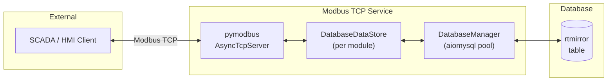
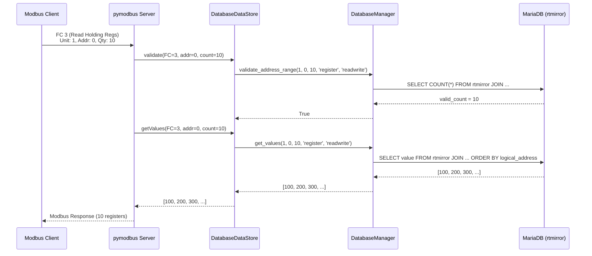

## Overview

The **Modbus TCP Server** is a Python microservice that exposes PLC I/O data to external SCADA/HMI systems using the standard **Modbus TCP/IP protocol**. It acts as a **gateway** between the MariaDB `rtmirror` table and Modbus TCP clients.

<Note>
  This service does **not** communicate with hardware directly. It reads/writes from the shared database, which is synchronized with hardware by the C++ core.
</Note>

## Architecture



## Technology Stack

| Component | Library | Purpose |
|-----------|---------|---------|
| Modbus Server | `pymodbus >= 3.10` | Async TCP server, Modbus PDU handling |
| Database | `aiomysql` | Non-blocking MariaDB connection pool |
| Async Runtime | `asyncio` | Single-threaded event loop |
| Configuration | `config_loader.py` | Loads `config/config.json` |

## Key Classes

### DatabaseManager

Encapsulates all database operations using an `aiomysql` connection pool for non-blocking I/O:

```python
class DatabaseManager:
    async def connect(self)        # Creates aiomysql connection pool
    async def close(self)          # Closes pool gracefully
    async def validate_address_range(self, module_id, start, count, io_type, hw_access)
    async def get_values(self, module_id, start, quantity, io_type, hw_access)
    async def write_values(self, module_id, start, values, io_type, hw_access)
    async def get_all_module_ids(self)
```

<ParamField path="validate_address_range()" type="bool">
  Validates that all addresses in the requested range exist in the database by joining `rtmirror` with `model_io_definition`. Used before every read/write operation to ensure strict data integrity.
</ParamField>

<ParamField path="get_values()" type="list[int]">
  Reads `value` from `rtmirror` for a contiguous range of addresses. Returns values sorted by logical address. Raises `ModbusIOException(0x02)` (Illegal Data Address) if the count doesn't match.
</ParamField>

<ParamField path="write_values()" type="bool">
  Performs an **atomic batch update** using a SQL `CASE` statement to write all values in a single transaction. Updates `required_value` in `rtmirror`, which the C++ core will pick up on its next database sync cycle.
</ParamField>

### DatabaseDataStore

A custom `ModbusBaseDeviceContext` subclass that routes all Modbus operations through the database using native async methods:

```python
class DatabaseDataStore(ModbusBaseDeviceContext):
    def __init__(self, module_id, db_manager)
    async def async_getValues(self, func_code, address, count)
    async def async_setValues(self, func_code, address, values)
```

<Tip>
  Validation is performed inside `async_getValues`/`async_setValues` directly, ensuring all I/O operations (including permission checks) are fully non-blocking.
</Tip>

## Modbus Data Model

The server maps Modbus function codes to the database schema using a strict `(io_type, hardware_access)` key:

| Modbus Area | Function Codes | `io_type` | `hardware_access` | Description |
|---|---|---|---|---|
| **Coils** | FC 1, 5, 15 | `bit` | `readwrite` | Read/Write output bits |
| **Discrete Inputs** | FC 2 | `bit` | `readonly` | Read-only input bits |
| **Holding Registers** | FC 3, 6, 16 | `register` | `readwrite` | Read/Write output registers |
| **Input Registers** | FC 4 | `register` | `readonly` | Read-only input registers |

### Function Code Mapping

```python
def _get_op_params(self, function_code):
    if function_code in [1, 5, 15]:   # Coils
        return 'bit', 'readwrite'
    elif function_code == 2:           # Discrete Inputs
        return 'bit', 'readonly'
    elif function_code in [3, 6, 16]: # Holding Registers
        return 'register', 'readwrite'
    elif function_code == 4:           # Input Registers
        return 'register', 'readonly'
```

## Multi-Device Support

The server dynamically discovers all configured modules from the `devices` table and creates a separate `DatabaseDataStore` for each one:

```python
module_ids = await db_manager.get_all_module_ids()  # [1, 2, 3, ...]
slave_contexts = {i: DatabaseDataStore(i, db_manager) for i in module_ids}
context = ModbusServerContext(devices=slave_contexts, single=False)
```

Each module ID corresponds to a **Modbus Unit ID** (slave address). A client request to Unit ID 3 is routed to the `DatabaseDataStore` for module 3.

## Request Flow



## Atomic Writes

Write operations use a single SQL `UPDATE ... CASE` statement to ensure atomicity:

```sql
UPDATE rtmirror r
JOIN model_io_definition mid ON r.fk_io_definition_id = mid.io_definition_id
SET r.required_value = CASE mid.logical_address
    WHEN 0 THEN 100
    WHEN 1 THEN 200
    WHEN 2 THEN 300
  END
WHERE r.fk_module_id = 1
  AND mid.io_type = 'register'
  AND mid.hardware_access = 'readwrite'
  AND mid.logical_address IN (0, 1, 2);
```

<Warning>
  If any address in a write operation is invalid, the entire transaction is rolled back. This prevents partial updates that could leave the system in an inconsistent state.
</Warning>

## Configuration

From `config/config.json`:

```json
{
  "services": {
    "modbustcp": {
      "host": "0.0.0.0",
      "port": 502
    }
  }
}
```

## Running as systemd Service

```bash
# Service name
plc_osologic-modbustcp

# View logs
journalctl -u plc_osologic-modbustcp -f

# Manual start
sudo systemctl start plc_osologic-modbustcp
```
