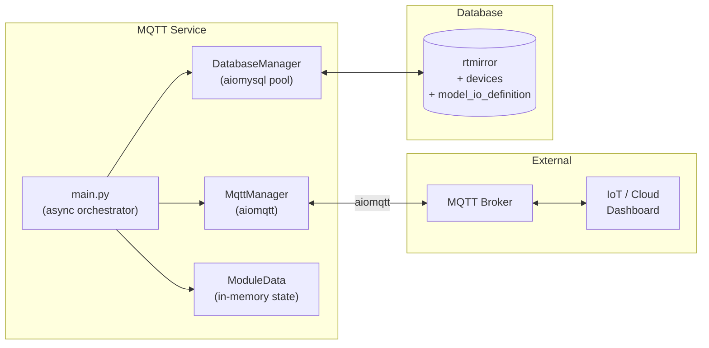
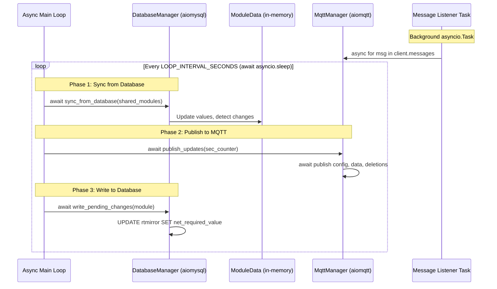
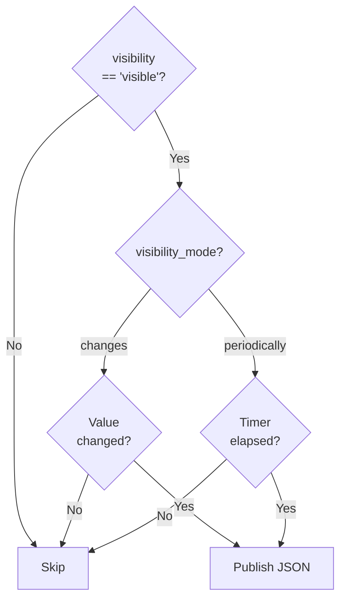

## Overview

The **MQTT Gateway** is a Python microservice that bridges the PLC's I/O state to an MQTT broker. It enables:

- **Publishing** real-time I/O values as structured JSON payloads
- **Subscribing** to write commands for remote output control
- **Dynamic discovery** of modules added/removed at runtime

<Note>
  Like the Modbus TCP server, this service communicates exclusively with the **database** (not directly with hardware). The C++ core handles all physical I/O synchronization.
</Note>

## Architecture



## Technology Stack

| Component | Library | Purpose |
|-----------|---------|---------|
| MQTT Client | `aiomqtt` | Async Publish/Subscribe with retained messages |
| Database | `aiomysql` | Non-blocking MariaDB connection pool |
| Async Runtime | `asyncio` | Single-threaded event loop (no threading) |
| Configuration | `config_loader.py` | Loads `config/config.json` |

<Tip>
  The service is 100% asynchronous. All database queries and MQTT operations are non-blocking, running on a single `asyncio` event loop without any `threading.Lock`.
</Tip>

## Main Loop — Three-Phase Cycle

The service runs a continuous `async` loop with three distinct phases. A background `asyncio.Task` listens for incoming MQTT write commands concurrently:



### Phase 1 — Database Read

`DatabaseManager.sync_from_database()`:
1. Detects **new devices** added to the `devices` table → creates `ModuleData` instances
2. Detects **removed devices** → marks as disconnected, schedules MQTT topic cleanup
3. For connected devices: reads all I/O values, visibility config, and metadata from `rtmirror` + `model_io_definition` + `module_io_config`

### Phase 2 — MQTT Publish

`MqttManager.publish_updates()`:
1. Publishes **deletions** (null retained messages for removed topics)
2. Publishes **config updates** (`/plc/info/`) when device config changes
3. Publishes **data updates** (`/plc/data/`) based on visibility rules

### Phase 3 — Database Write

`DatabaseManager.write_pending_changes()`:
- Writes MQTT-received `required_value` changes back to `rtmirror.net_required_value`
- Database triggers automatically convert to raw `required_value`

## Topic Structure

All topics follow the pattern `/plc/{category}/{module_id}/...`:

### Info Topics (`/plc/info/`)

Published when a device's configuration changes. All retained.

| Topic | Payload | Description |
|-------|---------|-------------|
| `/plc/info/{id}/is_connected` | `"1"` or `"0"` | Connection status |
| `/plc/info/{id}/module_name` | `"Expansion A"` | Human-readable name |
| `/plc/info/{id}/fk_model_id` | `"5"` | Model template ID |
| `/plc/info/{id}/channel_type` | `"spi"` | Communication channel |
| `/plc/info/{id}/protocol` | `"osologic-spi"` | Protocol name |
| `/plc/info/{id}/connection_string` | `"embedded-spi"` | Connection details |
| `/plc/info/{id}/address_on_channel` | `"1"` | Address on bus |
| `/plc/info/{id}/timeout_ms` | `"1000"` | Timeout in ms |
| `/plc/info/{id}/last_seen` | `"2026-01-15 10:23:45"` | Last communication |

### Data Topics (`/plc/data/`)

Published when I/O values change or periodically. Payload is **structured JSON**.

**Topic format:** `/plc/data/{module_id}/{io_type}/{address}`

**Example:** `/plc/data/1/registers/5`

**JSON Payload:**
```json
{
  "module_id": 1,
  "module_name": "Expansion A",
  "io_type": "register",
  "address": 5,
  "label": "Temperature Sensor",
  "value": 23.5,
  "raw_value": 235,
  "units": "°C",
  "purpose": "standard",
  "hardware_access": "readonly",
  "scale_factor": 0.1,
  "offset": 0.0,
  "timestamp": "2026-01-15T10:23:45+0100"
}
```

### Write Topics (`/plc/write/`)

Subscribe pattern: `/plc/write/#`

**Topic format:** `/plc/write/{module_id}/{io_type}/{address}`

**Payload:** Numeric value as string (e.g., `"1"`, `"23.5"`)

**Example:** Publishing `"1"` to `/plc/write/1/bits/3` sets bit 3 on module 1 to HIGH.

## Visibility System

Each I/O point has configurable visibility settings stored in the `module_io_config` table:

| Setting | Options | Description |
|---------|---------|-------------|
| `visibility` | `visible`, `hidden` | Whether the point is published to MQTT |
| `visibility_mode` | `changes`, `periodically` | Publish trigger mode |
| `refresh_rate` | Integer (ms) | Publish interval for periodic mode |



## Write Permission Enforcement

Write commands from MQTT are validated against the `hardware_access` field:

```python
permission = module.permissions[permission_type].get(address, 'readonly')
if permission != 'readwrite':
    _logger.warning(f"MQTT_WRITE_DENIED: Write denied for {io_type}[{address}]")
    return  # Silently reject
```

<Warning>
  Only I/O points defined with `hardware_access = 'readwrite'` accept write commands. Attempts to write to `readonly` points are silently discarded with a log message.
</Warning>

## ModuleData Class

The in-memory representation of a device with all its state:

```python
class ModuleData:
    # Identity
    id: int
    module_name: str
    fk_model_id: int

    # I/O maps (address → value)
    bits: Dict[int, int]
    registers: Dict[int, float]
    required_bits: Dict[int, int]
    required_registers: Dict[int, float]

    # Rich metadata per I/O point
    bits_info: Dict[int, Dict]       # label, units, purpose, etc.
    registers_info: Dict[int, Dict]

    # Visibility configuration
    visibility_bits: Dict[int, Dict]
    visibility_registers: Dict[int, Dict]

    # Permissions (from model_io_definition)
    permissions: Dict[str, Dict[int, str]]  # {'bit': {0: 'readonly'}, ...}

    # Control flags
    config_topic_needs_update: bool
    db_write_pending: bool
    data_is_prepared: bool
```

## Initial Cleanup

At startup, the service performs an async cleanup of **stale retained messages** on the broker:

1. `await client.subscribe("/plc/#")` — Subscribe to all PLC topics
2. `await asyncio.sleep(2)` — Allow broker to deliver all retained messages
3. For each received message matching our prefixes, `await client.publish(topic, None, retain=True)` to clear it
4. `await client.unsubscribe("/plc/#")`

This ensures a clean state if the service was previously running with a different module configuration.

## Configuration

From `config/config.json`:

```json
{
  "services": {
    "mqtt": {
      "broker_address": "localhost",
      "port": 1883,
      "client_id": "plc_osologic",
      "password": "mqtt_password",
      "topic_info_prefix": "/plc/info",
      "topic_data_prefix": "/plc/data",
      "topic_write_prefix": "/plc/write",
      "loop_interval_seconds": 1
    }
  }
}
```

## Running as systemd Service

```bash
# Service name
plc_osologic-mqtt

# View logs
journalctl -u plc_osologic-mqtt -f

# Manual start
sudo systemctl start plc_osologic-mqtt
```
