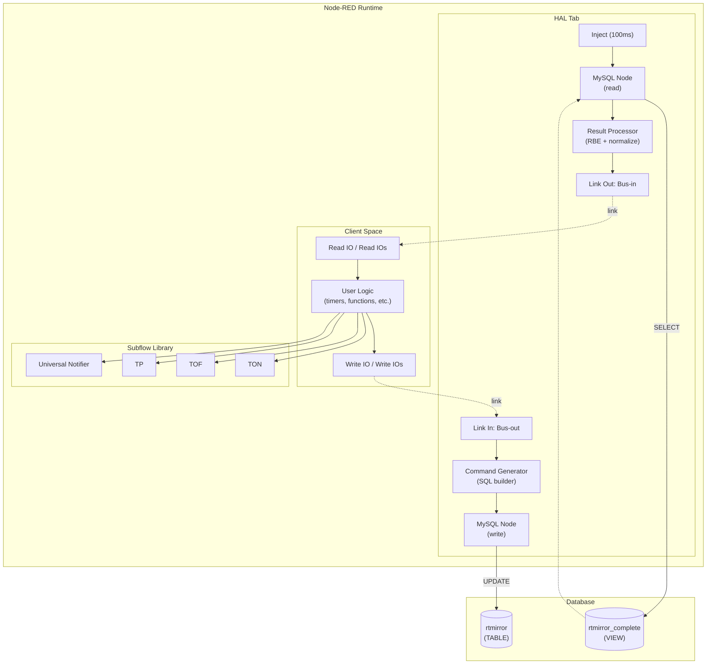
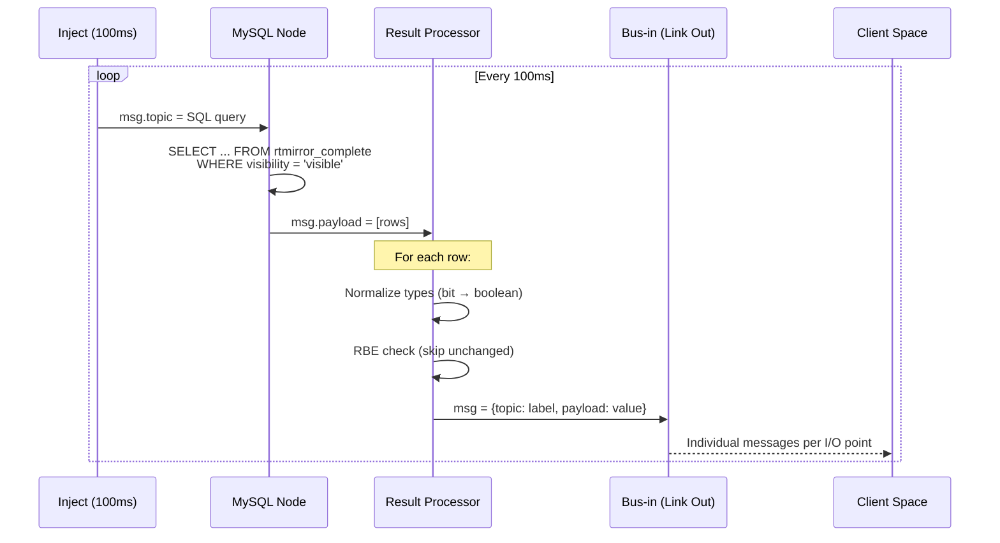
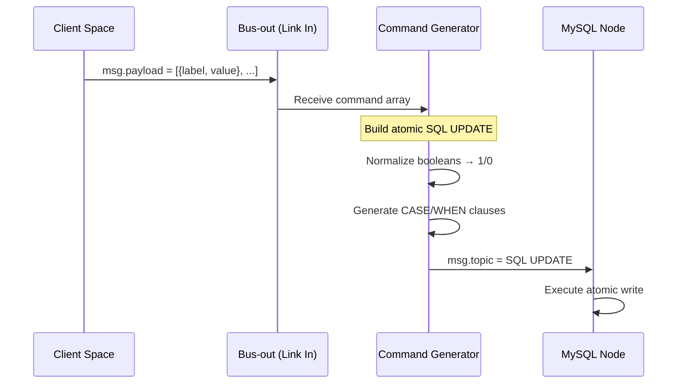

## Overview

The **Node-RED Interface** is a flow-based programming layer that acts as the primary **HMI bridge** between the PLC Core (C++) and the operator. It communicates exclusively through the MariaDB database using the `rtmirror` table and the `rtmirror_complete` view.

<Note>
  Like all OSOlogic services, Node-RED does **not** communicate with hardware directly. The C++ core handles all physical I/O synchronization through the shared database.
</Note>

## Architecture



## Technology Stack

| Component | Library / Version | Purpose |
|-----------|------------------|---------|
| Runtime | `Node-RED >= 3.0` | Flow execution engine |
| Dashboard | `@flowfuse/node-red-dashboard` | Dashboard 2.0 UI widgets |
| Database | `node-red-node-mysql` + `node-red-contrib-mysql2` | MariaDB read/write |
| Notifications | `node-red-contrib-telegrambot` + `node-red-node-email` | Alert routing |
| Configuration | `node-red-contrib-mysql-config` (v1.0.4) | MySQL connection management |

## Source Location

```
source/addons/services/node-red-interface/
├── flows.json          # Complete flow definitions (all tabs + subflows)
├── flows_cred.json     # Encrypted credentials
├── package.json        # Node dependencies
└── README.md           # Module documentation
```

During installation, `flows.json` is processed with `jq` to update the database connection parameters and copied to `~/.node-red/flows.json`.

## HAL Tab — Internals

The `[CORE] HAL` tab implements the bidirectional database synchronization. It consists of two independent data paths.

### Read Path (Polling)



**SQL Query:**
```sql
SELECT io_definition_id, user_label, net_value, io_type, units, purpose 
FROM rtmirror_complete 
WHERE visibility = 'visible'
```

**Result Processor logic (function node):**

1. **Type normalization** — Converts DOUBLE values from the DB: if `io_type = 'bit'`, the value is cast to boolean (`true`/`false`)
2. **RBE (Report By Exception)** — Maintains a `lastState` map in node context. Only emits a message when a value actually changes
3. **Message format** — Each I/O point becomes an individual message:
   - `msg.topic` = `user_label`
   - `msg.payload` = normalized value
   - `msg.displayValue` = formatted string with units (e.g., `"23.5 °C"`)
   - `msg.units` = unit string
   - `msg.purpose` = I/O purpose classification

### Write Path (Commands)



**Generated SQL:**
```sql
UPDATE rtmirror rt
JOIN module_io_config cfg 
    ON rt.fk_module_id = cfg.fk_module_id 
    AND rt.fk_io_definition_id = cfg.fk_io_definition_id
JOIN model_io_definition mid
    ON rt.fk_io_definition_id = mid.io_definition_id
SET rt.net_required_value = CASE cfg.user_label 
    WHEN 'Output 1' THEN 1 
    WHEN 'Output 2' THEN 0 
END
WHERE cfg.user_label IN ('Output 1','Output 2')
AND mid.hardware_access = 'readwrite'
```

<Warning>
  The `WHERE hardware_access = 'readwrite'` clause is a critical safety mechanism. It prevents any Node-RED flow — even a misconfigured one — from writing to read-only inputs.
</Warning>

## Subflow API Reference

### Read IO

Filters the HAL bus for a single label.

| Property | Type | Description |
|----------|------|-------------|
| `label` | `string` | The `user_label` to filter for |

**Internal:** Uses a `switch` node that compares `msg.topic` against the `label` environment variable.

**Input:** Individual bus messages from `Bus-in`
**Output:** Messages matching the configured label (RBE — only on change)

### Read IOs

Filters the HAL bus for a group of labels and outputs an ordered array.

| Property | Type | Description |
|----------|------|-------------|
| `labels` | `json` (string array) | Array of `user_label` values to filter |

**Internal:** Uses a function node with `context.get('state')` to maintain an aggregated state map. On each matching message, updates the map and outputs the full array in label-defined order.

**Output:** `msg.payload` = `[value1, value2, ...]` (ordered by `labels` array index)

### Write IO

Writes a single value to a specific label.

| Property | Type | Description |
|----------|------|-------------|
| `label` | `string` | Target `user_label` |
| `value` | `number` | Value to write (when `use_fixed_value = true`) |
| `use_fixed_value` | `boolean` | If `true`, uses configured value; if `false`, uses `msg.payload` |

**Internal:** Function node that normalizes the value (boolean → 1/0, string → parseFloat) and packages it as `[{label, value}]` array for the Command Generator.

### Write IOs

Writes multiple values to multiple labels atomically.

| Property | Type | Description |
|----------|------|-------------|
| `labels` | `json` (string array) | Target `user_label` values |
| `values` | `json` (number array) | Values to write (when `use_fixed_values = true`) |
| `use_fixed_values` | `boolean` | If `true`, uses configured arrays; if `false`, uses `msg.payload` (must be array) |

**Internal:** Maps labels to values by index, normalizes each value, and outputs the command array `[{label, value}, ...]`.

### TON (Timer On-Delay)

| Property | Type | Default | Description |
|----------|------|---------|-------------|
| `delay_ms` | `number` | `1000` | Delay before output activates |

**Internal:** `switch` → branches on `true`/`false`. The `true` branch enters a `trigger` node configured with the delay. The `false` branch sends a `msg.reset` to cancel the trigger.

### TOF (Timer Off-Delay)

| Property | Type | Default | Description |
|----------|------|---------|-------------|
| `delay_ms` | `number` | `1000` | Delay before output deactivates |

**Internal:** Same pattern as TON but inverted — `true` resets the trigger, `false` starts the delay countdown.

### TP (Timer Pulse)

| Property | Type | Default | Description |
|----------|------|---------|-------------|
| `pulse_duration_ms` | `number` | `1000` | Fixed pulse duration |

**Internal:** `switch` → only passes `true` (rising edge). `trigger` node emits `true` immediately, then `false` after the duration. The `extend` option is disabled to ignore retriggering during active pulse.

### Universal Notifier

| Property | Type | Description |
|----------|------|-------------|
| `email_recipient` | `string` | Target email address |
| `telegram_chatid` | `string` | Telegram Chat ID |

**Input:** `msg.payload` = text, `msg.priority` = `"1"` / `"2"` / `"3"`

**Internal:** `switch` on `msg.priority` with cascading outputs:
- Priority 1 → File node (log)
- Priority 2 → File + Email node
- Priority 3 → File + Email + Change node → Telegram sender

**Dependencies:**
- Email: `node-red-node-email` (SMTP config required)
- Telegram: `node-red-contrib-telegrambot` (Bot token required)

## Database Views Used

### rtmirror_complete

The HAL polling query targets `rtmirror_complete`, a database **VIEW** that joins:

| Source Table | Fields Used |
|-------------|-------------|
| `rtmirror` | `net_value`, `net_required_value`, `fk_module_id` |
| `module_io_config` | `user_label`, `visibility`, `units` |
| `model_io_definition` | `io_type`, `hardware_access`, `purpose` |

This view provides a single, flat representation of all I/O points with their current values, labels, and metadata.

## Configuration

From `config/config.json`:

```json
{
  "services": {
    "nodered": {
      "host": "localhost",
      "port": 1880,
      "external_url": "https://192.168.1.152:1880/",
      "credential_secret": "auto-generated-hex-key"
    }
  }
}
```

| Field | Description |
|-------|-------------|
| `host` | Node-RED bind address |
| `port` | HTTP/HTTPS port for the editor and dashboard |
| `external_url` | URL used by the Service Manager to link to Node-RED |
| `credential_secret` | Encryption key for `flows_cred.json` (auto-generated during installation) |

## Running as systemd Service

```bash
# Service name
nodered

# View logs
journalctl -u nodered -f

# Manual start
sudo systemctl start nodered

# Restart after flow import
sudo systemctl restart nodered
```

## Installation Integration

The `install_OsoLogic.sh` script handles the full Node-RED setup:

1. **Node-RED runtime** — Installed via the official Linux installer for user `oso`
2. **Settings** — `~/.node-red/settings.js` is generated with HTTPS, project features, and the credential secret
3. **Flows** — `flows.json` is copied from `source/addons/services/node-red-interface/` and processed with `jq` to update database connection parameters
4. **Dependencies** — All npm packages (Dashboard 2.0, MySQL, Telegram, Email) are installed in `~/.node-red/`
5. **Service** — The `nodered` systemd service is enabled for automatic startup
