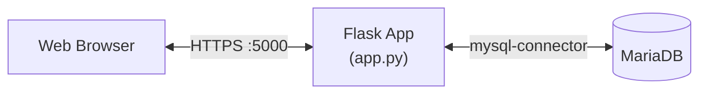

## Overview

The **GUI Admin** is a Flask web application that provides a complete CRUD interface for the PLC database. It allows operators and administrators to manage device models, I/O definitions, device instances, and PLC settings through a modern web interface.

## Architecture



## Authentication & RBAC

The system implements **Role-Based Access Control** with three levels:

| Role | Level | Permissions |
|------|-------|-------------|
| `admin` | 3 | Full access: manage users, models, devices, settings |
| `operator` | 2 | Create/edit devices and I/O configurations |
| `viewer` | 1 | Read-only access to all data |

Authentication uses **SHA-256 with random salt** (`salt$hash` format). Sessions are managed by Flask with configurable timeout.

### Decorators

```python
@login_required      # Any authenticated user
@operator_required   # operator or admin
@admin_required      # admin only
```

## REST API Reference

### Models (`model_config`)

| Method | Endpoint | Auth | Description |
|--------|----------|------|-------------|
| `GET` | `/api/models` | login | List all models |
| `GET` | `/api/models/{id}` | login | Get single model |
| `GET` | `/api/models/{id}/full` | login | Model + IO defs + secure state maps + aggregated children |
| `POST` | `/api/models` | login | Create model |
| `PUT` | `/api/models/{id}` | login | Update model |
| `DELETE` | `/api/models/{id}` | login | Delete model |

### I/O Definitions (`model_io_definition`)

| Method | Endpoint | Auth | Description |
|--------|----------|------|-------------|
| `POST` | `/api/io-definitions/batch` | login | Create multiple I/O defs |
| `PUT` | `/api/io-definitions/batch-update` | login | Update multiple I/O defs |
| `POST` | `/api/io-definitions/batch-delete` | login | Delete multiple I/O defs |

### Devices (`devices`)

| Method | Endpoint | Auth | Description |
|--------|----------|------|-------------|
| `GET` | `/api/devices` | login | List all devices |
| `POST` | `/api/devices` | login | Create device |
| `PUT` | `/api/devices/{id}` | login | Update device |
| `DELETE` | `/api/devices/{id}` | login | Delete device |

### Aggregated Models

| Method | Endpoint | Auth | Description |
|--------|----------|------|-------------|
| `GET` | `/api/aggregated-model-children?model_id=X` | login | Get children for an aggregated model |
| `POST` | `/api/aggregated-model-children/batch` | login | Replace all children for a model |

### PLC Settings

| Method | Endpoint | Auth | Description |
|--------|----------|------|-------------|
| `GET` | `/api/plc-settings` | login | Get current settings |
| `PUT` | `/api/plc-settings` | operator | Update settings |

### User Management

| Method | Endpoint | Auth | Description |
|--------|----------|------|-------------|
| `GET` | `/api/users` | admin | List all users |
| `POST` | `/api/users` | admin | Create user |
| `PUT` | `/api/users/{id}` | admin | Update user |
| `DELETE` | `/api/users/{id}` | admin | Delete user |

## Input Validation

All API endpoints use a centralized validation system with typed rules:

```python
MODEL_RULES = [
    ('model_name', 'Model name', 'str', True, {'min_len': 1, 'max_len': 100}),
    ('protocol', 'Protocol', 'str', False, 
     {'choices': ['osologic-spi', 'modbus-rtu', 'modbus-tcp', 'aggregated']}),
    ('default_timeout_ms', 'Default timeout', 'int', False, {'min': 0, 'max': 60000}),
]
```

Validation supports: type coercion, required checks, range limits, enum choices, and string length.

## Configuration

From `config/config.json`:

```json
{
  "services": {
    "gui": {
      "host": "0.0.0.0",
      "port": 5000,
      "secret_key": "your-secret-key",
      "session_timeout": 30,
      "external_url": "http://plc-host:5000"
    }
  }
}
```

## Running

```bash
# Service name
plc_osologic-gui

# View logs
journalctl -u plc_osologic-gui -f
```
