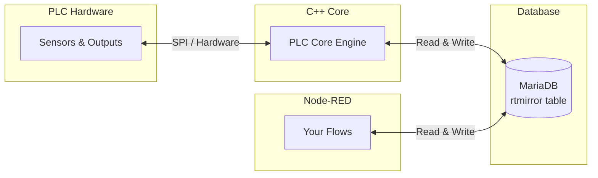

## How Node-RED Communicates with the PLC

Node-RED does **not** talk to the PLC hardware directly. Instead, it uses the **MariaDB database** as a shared communication channel:



- **Reading**: Node-RED polls the database every 100ms and broadcasts the values on an internal bus
- **Writing**: Node-RED generates SQL commands to update the `net_required_value` field, which the C++ core picks up and sends to the hardware

## Reading I/O Values

### Read IO — Single Point

The **Read IO** subflow filters the internal bus for a **single I/O label** and outputs its value whenever it changes.

<Steps>
  <Step title="Add the node">
    Drag a **Read IO** subflow from the palette onto the `Client Space` tab.
  </Step>
  <Step title="Connect the bus">
    Connect a **link in** node to the input. The link must point to the `Bus-in` link in the `[CORE] HAL` tab.
  </Step>
  <Step title="Configure the label">
    Double-click the node and set the `label` property to the exact **user_label** of the I/O point you want to read (e.g., `"Temperature Sensor"`).
  </Step>
  <Step title="Use the output">
    Connect the output to any node you want — a debug node, a dashboard gauge, a function node, etc. The output message will be:
    - `msg.topic` = the label name
    - `msg.payload` = the current value (`true`/`false` for bits, number for registers)
  </Step>
</Steps>

### Read IOs — Multiple Points

The **Read IOs** subflow filters the bus for a **group of labels** simultaneously. It outputs an ordered array of values every time any of them changes.

<Steps>
  <Step title="Add and connect">
    Same as Read IO — drag the node and connect the bus.
  </Step>
  <Step title="Configure labels">
    Set the `labels` property to a JSON array of label names:
    ```json
    ["Sensor 1", "Sensor 2", "Output 3"]
    ```
  </Step>
  <Step title="Use the output">
    The output `msg.payload` is an ordered array matching your labels: `[value1, value2, value3]`. This format is compatible with the **Write IOs** subflow for pass-through logic.
  </Step>
</Steps>

## Writing I/O Values

### Write IO — Single Point

The **Write IO** subflow writes a single value to a specific I/O label.

<Steps>
  <Step title="Add the node">
    Drag a **Write IO** subflow onto the canvas.
  </Step>
  <Step title="Connect the output">
    Connect the output to a **link out** node pointing to the `Bus-out` link in the `[CORE] HAL` tab.
  </Step>
  <Step title="Configure">
    Double-click the node and set:
    - `label` — The **user_label** of the output to write to
    - `value` — The value to write (used when `use_fixed_value` is checked)
    - `use_fixed_value` — If checked, always sends the configured `value`. If unchecked, sends whatever arrives in `msg.payload`
  </Step>
  <Step title="Trigger">
    Connect any trigger to the input — a button, a timer, another I/O signal, etc.
  </Step>
</Steps>

### Write IOs — Batch Write

The **Write IOs** subflow writes **multiple values** to multiple labels in a single database transaction.

<Steps>
  <Step title="Add and connect">
    Same as Write IO — drag the node and connect the output to `Bus-out`.
  </Step>
  <Step title="Configure">
    Set the following properties:
    - `labels` — JSON array of output labels: `["Output 1", "Output 2"]`
    - `values` — JSON array of values: `[1, 0]`
    - `use_fixed_values` — If checked, uses the configured arrays. If unchecked, uses `msg.payload` (must be an array in the same order as `labels`)
  </Step>
</Steps>

<Tip>
  **Read IOs → Write IOs**: You can connect a Read IOs node directly to a Write IOs node to create "mirror" or "pass-through" logic. The output format of Read IOs matches exactly what Write IOs expects.
</Tip>

## Important Rules

<Warning>
  **Labels must be unique**: The entire flow system relies on `user_label` being unique across the project. If two I/O points share the same label, behavior is undefined.
</Warning>

<Warning>
  **Only write to outputs**: The system will only accept writes to I/O points with `hardware_access = 'readwrite'`. Writes to read-only inputs are silently ignored by the database query (it includes a safety `WHERE` clause).
</Warning>

<Note>
  The values you read and write in Node-RED are **engineering values** (NET values) — already converted to real units (°C, Bar, %) using the scale factor and offset defined in the I/O configuration. You never need to deal with raw hardware values.
</Note>
