## Overview

OSOlogic ships with a library of **subflows** — reusable blocks that implement standard PLC functionality inside Node-RED. These blocks are ready to use and follow industrial automation conventions.

## I/O Blocks

These blocks are covered in detail on the [Reading & Writing I/O](/users/nodered/io) page:

| Block | Purpose |
|-------|---------|
| **Read IO** | Filter the bus for a single I/O label |
| **Read IOs** | Filter the bus for a group of labels (outputs ordered array) |
| **Write IO** | Write a single value to one output label |
| **Write IOs** | Write multiple values to multiple labels in one transaction |

## Timer Blocks

The timer subflows implement the three standard PLC timer types. They all accept a **boolean input** (`true`/`false`) and produce a **boolean output**.

### TON — Timer On-Delay

The output turns `true` only **after the input has been `true` for the specified delay**. If the input goes `false` before the delay expires, the timer resets and the output stays `false`.

**Use case:** Prevent false alarms — only trigger if a condition persists for a certain time.

```mermaid
gantt
  title TON Behavior (delay = 2s)
  dateFormat X
  axisFormat %S s
  section Input
    HIGH :a1, 0, 5
  section Output
    LOW (waiting) :crit, b1, 0, 2
    HIGH :b2, 2, 5
```



**Properties:**

| Property | Type | Default | Description |
|----------|------|---------|-------------|
| `delay_ms` | Number | `1000` | Delay in milliseconds before the output activates |

### TOF — Timer Off-Delay

The output turns `true` **immediately** when the input goes `true`. When the input goes `false`, the output **stays `true` for the specified delay** before turning `false`.

**Use case:** Keep a pump running for 30 seconds after the fill sensor deactivates.

```mermaid
gantt
  title TOF Behavior (delay = 2s)
  dateFormat X
  axisFormat %S s
  section Input
    HIGH :a1, 0, 3
  section Output
    HIGH :b1, 0, 5
    LOW :crit, b2, 5, 6
```



**Properties:**

| Property | Type | Default | Description |
|----------|------|---------|-------------|
| `delay_ms` | Number | `1000` | Delay in milliseconds before the output deactivates |

### TP — Timer Pulse

On a **rising edge** (input goes from `false` to `true`), the output produces a `true` pulse for exactly the specified duration. Subsequent triggers during the pulse are **ignored**.

**Use case:** Generate a fixed-duration activation pulse from a momentary signal.

```mermaid
gantt
  title TP Behavior (duration = 2s)
  dateFormat X
  axisFormat %S s
  section Input
    TRIGGER :a1, 0, 1
  section Output
    PULSE :b1, 0, 2
```



**Properties:**

| Property | Type | Default | Description |
|----------|------|---------|-------------|
| `pulse_duration_ms` | Number | `1000` | Pulse duration in milliseconds |

### Example — Using TON with Read IO

<Steps>
  <Step title="Read the sensor">
    Add a **Read IO** node configured for `"Pressure Sensor"`.
  </Step>
  <Step title="Add a threshold check">
    Add a **Switch** node to check if `msg.payload > 5.0` (Bar).
  </Step>
  <Step title="Add the TON timer">
    Connect the switch output to a **TON** subflow with `delay_ms = 3000` (3 seconds).
  </Step>
  <Step title="Trigger an action">
    Connect the TON output to a **Write IO** node to activate an alarm output, or to a **Universal Notifier** to send an alert.
  </Step>
</Steps>

## Universal Notifier

A centralized notification hub that routes alerts to **multiple channels** based on priority level.

### Priority Levels

| Priority | Value | Channels |
|----------|-------|----------|
| **Info** | `1` | 📄 Log file only |
| **Warning** | `2` | 📄 Log file + 📧 Email |
| **Critical** | `3` | 📄 Log file + 📧 Email + 📱 Telegram |

### Input Message Format

The Universal Notifier expects:
- `msg.payload` — The notification text
- `msg.priority` — `"1"`, `"2"`, or `"3"`

### Properties

| Property | Type | Description |
|----------|------|-------------|
| `email_recipient` | String | Email address for Warning and Critical alerts |
| `telegram_chatid` | String | Telegram Chat ID for Critical alerts |

<Note>
  Email requires a configured SMTP sender node (Gmail, Outlook, etc.). Telegram requires a configured Bot Token. Both are set up inside the subflow using standard Node-RED nodes.
</Note>

### Example — Overpressure Alert

```
Read IO ("Pressure") → Switch (> 10 Bar) → TON (5s) → Universal Notifier (priority=3)
```

This sends a **Critical** alert (log + email + Telegram) if pressure exceeds 10 Bar for more than 5 seconds.
