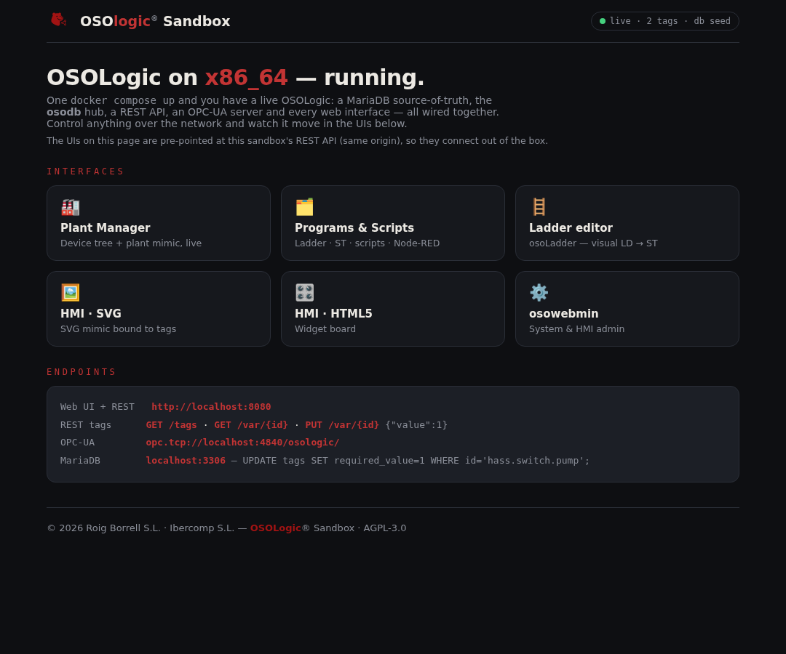

# OSOLogic Sandbox — x86_64

**© 2026 Roig Borrell S.L. · Ibercomp S.L.** · Part of [OSOLogic](https://github.com/OSOlogic/platform) · AGPL-3.0-or-later



Spin up a **live OSOLogic on any x86_64 machine** with one command, then control things over the
network and watch them move in the interfaces. It brings up, wired together:

- **MariaDB** — the source-of-truth `tags` table (the plant is rows)
- **osodb core** *(reference)* — caches the DB and exposes it as **REST** + **OPC-UA**, with a scan
  loop that applies set-points and simulates a few sensors
- **the web frontend** — Plant Manager, Programs & Scripts, Ladder editor, HMIs, osowebmin

> This is the **base x86_64 implementation / dev sandbox**. The core here is a small Python
> reference so the stack runs everywhere; it will be swapped for the real C++ `osoruntime`/`osodb`.

## Run it (Linux · Windows · macOS)

Docker is the cross-platform vehicle — the **same command** everywhere:

```bash
cd sandbox
docker compose up --build
```

Then open **http://localhost:8080**.

| OS | How |
|----|-----|
| **Linux** | Docker Engine (native). Also runs bare-metal — see below. |
| **Windows** | **Docker Desktop** (WSL2 backend) — runs it in a lightweight Linux VM automatically. |
| **macOS** | **Docker Desktop** — same, in its built-in VM. |

Any headless VM works too (the whole thing is just Linux + containers). A one-click **Windows
package (WSL2)** is on the roadmap; Linux first.

## What you get

| Endpoint | URL |
|----------|-----|
| Web UI + landing | `http://localhost:8080` |
| REST — tags | `GET /tags` · `GET /var/{id}` · `PUT /var/{id}` `{"value":1}` |
| OPC-UA server | `opc.tcp://localhost:4840/osologic/` (ns `urn:osologic:sandbox`) |
| MariaDB | `localhost:3306` (db `osodb`, user `osoapp`/`osoapp`) |

The web tools on the landing page are auto-pointed at this sandbox's REST, so they connect out of the
box — open **Plant Manager** and watch the tank level and temperature move.

## Control anything over the network

Three equivalent ways to command the same tag — pick your protocol:

```bash
# REST
curl http://localhost:8080/var/hass.switch.pump
curl -X PUT http://localhost:8080/var/hass.switch.pump -d '{"value":1}'

# SQL (the DB is the plant)
mysql -h127.0.0.1 -uosoapp -posoapp osodb \
  -e "UPDATE tags SET required_value=1 WHERE id='hass.switch.pump';"

# OPC-UA — point any client (UaExpert, etc.) at opc.tcp://localhost:4840/osologic/
```

## Bare-metal (Linux, no Docker)

```bash
sudo sandbox/baremetal/install.sh      # MariaDB + Python deps + init + run
```

Installs MariaDB, loads `db/init.sql`, installs the core's Python deps, and runs
`core/oso_core.py` serving the repo — same endpoints as the container. See
[`baremetal/README.md`](baremetal/README.md).

## Roadmap

- Swap the reference core for the real **C++ `osoruntime` + `osodb`**.
- **Windows one-click package** (WSL2) and a headless-VM image.
- Wire the editors (Ladder/ST/Programs) to this REST so programs run against the sandbox.
