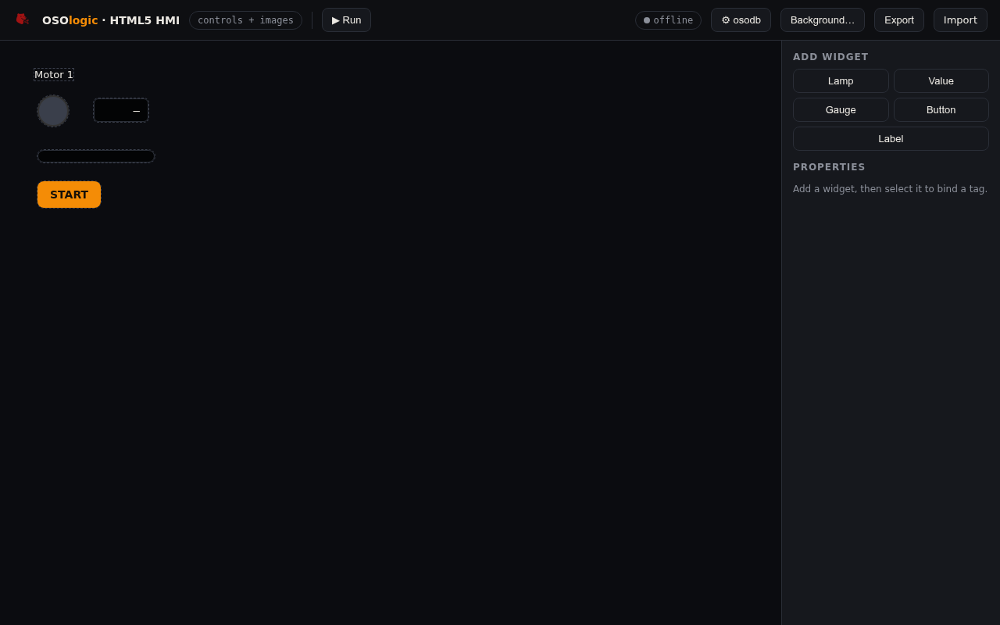

# HTML5 HMI — widget board

**© 2026 Roig Borrell S.L. · Ibercomp S.L.** · Part of [OSOLogic](https://github.com/OSOlogic/platform) · AGPL-3.0-or-later

A widget board over a **background image**: lamps, numeric values, gauges, push
buttons and labels — drag-positioned and bound to osodb tags. For control panels,
dashboards and quick operator screens.

## Use

Open `index.html`. In **edit** mode:

1. **Add widget** (Lamp / Value / Gauge / Button / Label) — it appears on the board;
   drag to position.
2. **Select it** → Properties: bind an **osodb tag**, and per type: lamp on/off
   colours, gauge min/max, button write-value.
3. **Background…** → set an image URL (a plant photo or schematic) behind the widgets.
4. **⚙ osodb** → REST base URL, then **▶ Run**: values update live; buttons write a
   set-point to osodb.

## Widgets

| Widget | Bound behaviour |
|--------|-----------------|
| **Lamp** | on/off colour by boolean tag |
| **Value** | shows the live value (text) |
| **Gauge** | bar scaled between min/max |
| **Button** | writes a set-point on click |
| **Label** | static text |

The board is a small JSON (`{ bg, widgets[] }`), exportable/importable. Live values
arrive via the shared client's `osodb:update` event.

> Prototype — foundations in place (widgets, binding, live + writes, background);
> richer widgets (trends, alarms) and snapping come next.
