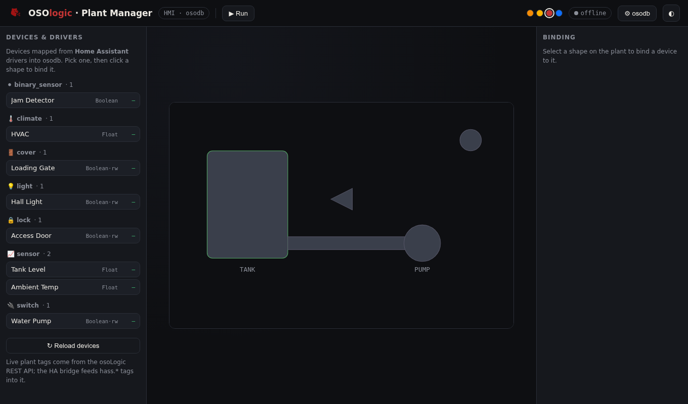

# Plant Manager — web HMI + Home Assistant drivers

**© 2026 Roig Borrell S.L. · Ibercomp S.L.** · Part of [OSOLogic](https://github.com/OSOlogic/platform) · AGPL-3.0-or-later



A web Plant Manager (in the spirit of Borrell Plant Manager): a **device/driver tree** on the
left, a **plant mimic** in the middle, and **bindings** on the right — all backed by
[`osodb`](../../../core/osodb).

The device tree can be populated from **Home Assistant** through the compatibility gateway, so a
device HA already supports (Zigbee, Z-Wave, Matter, MQTT, …) shows up as a typed osodb tag you can
drop onto the plant — alongside OSOLogic's own native I/O.

## Flow

1. **Devices & drivers** (left) — grouped by driver (light, switch, sensor, climate, cover, lock…),
   each entry a typed osodb tag (`Boolean·rw`, `Float`, …). Fed by
   [`gateways/home-assistant`](../../../gateways/home-assistant): the crawler discovers, the
   **mapper** turns HA entities into osodb tags.
2. **Plant** (centre) — draw/import an SVG mimic; every element with an `id` is bindable.
3. **Bind** — pick a device, click a shape, **Bind** → set on/off colours (or a live value label).
4. **Run** — polls the osoLogic REST API (which fronts osodb + the HA bridge) and drives the mimic
   live; set-points write back.

## Data path

```
Home Assistant ──► hass_bridge / mapper ──► osodb (hass.* tags) ──► REST ──► Plant Manager
                     (drivers → typed tags)          ▲                         │
                                                     └──── set-points ◄────────┘
```

## Populate devices

The device tree loads `devices.example.json` (a sample mapper output). Generate a real one:

```bash
# in gateways/home-assistant/reference
python3 hass_discover.py --out ../drivers/../mapping.json     # discover
python3 hass_mapper.py --live --out-json devices.json         # HA entities → osodb tags
# then serve devices.json next to this page
```

> Prototype — device tree, binding and live colouring are in place; drag-to-bind, alarms and a
> device→shape auto-layout come next.
