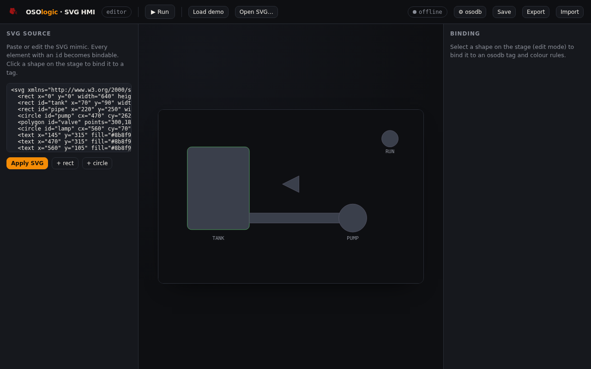

# SVG HMI — process mimic engine

**© 2026 Roig Borrell S.L. · Ibercomp S.L.** · Part of [OSOLogic](https://github.com/OSOlogic/platform) · AGPL-3.0-or-later

A vector HMI where **SVG shapes change colour by tag state** — the classic
process-diagram approach (as in Borrell Plant Manager). Draw/import an SVG mimic,
bind each shape to an osodb tag with colour rules, and watch it come alive.

## Use

Open `index.html` (no build step). In **edit** mode:

1. **Load demo** (a small plant) or paste/edit your SVG in the left panel — any
   element with an `id` is bindable.
2. **Click a shape** → the Binding panel opens. Set its **osodb tag** (pick from the
   list — includes `hass.*` bridge tags — or type a NodeId like `2.5`).
3. Add **colour rules** (`== 1 → green`, `> 80 → red`; default grey) and, optionally,
   show the live value as text.
4. **⚙ osodb** → set the osoLogic REST base URL. Press **▶ Run** — the mimic polls
   osodb and recolours in real time (edit panels collapse for the operator view).

## Data model

A small JSON (in the browser, exportable): `{ svg, bindings }` where
`bindings[shapeId] = { tag, default, label, rules:[{op,val,color}] }`. Live values
arrive via the shared client's `osodb:update` event.

## Files

| File | Role |
|------|------|
| `index.html` | The editor + runtime (self-contained) |
| `../../shared/osodb-client.js` | REST client to osodb (read/write/poll/listTags) |

> Prototype — the binding model, live polling and the osodb path are in place; a full
> vector editor, alarms and historisation come next.
