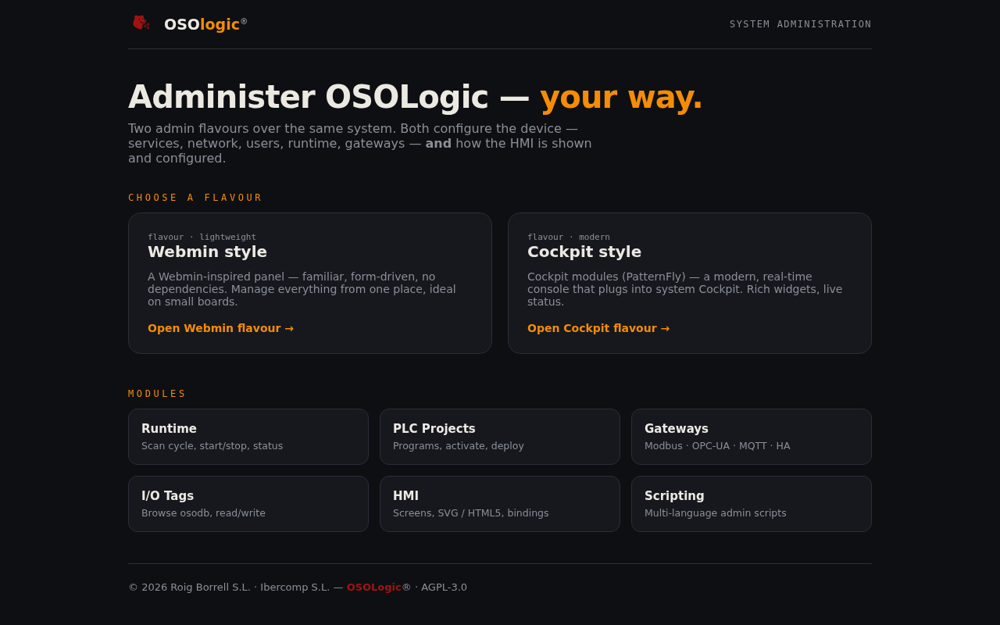

<div align="center">
  
  <h1>webmin-oso</h1>
  <p><strong>OSOlogic Web Administration — CPU &amp; MCU targets</strong></p>
  <p>
    
    
    
  </p>
</div>

---

## Admin — two flavours

[](index.html)

Two admin flavours over the same system, both configuring the device **and** how the
HMI is shown and configured — pick one at [`index.html`](index.html):

- **Webmin style** — a Webmin-inspired panel ([`public/`](public/)), lightweight and form-driven.
- **Cockpit style** — Cockpit modules ([`cockpit/`](cockpit/), PatternFly): `oso-runtime`,
  `oso-plc-projects`, `oso-gateways`, `oso-iotags`, and **[`oso-hmi`](cockpit/oso-hmi/)** (HMI screens).

Plus a multi-language **[scripting console](scripting/)**.

---

## Overview / Descripción

**webmin-oso** provides the browser-based administration layer for OSOlogic targets.  
It ships two independent web interfaces — one per runtime environment:

| Interface | Target | Runtime |
|-----------|--------|---------|
| **cockpit** | CPU — OSOlogic Linux (x86\_64 / arm64 / armv7) | Full OS + PREEMPT\_RT |
| **embedded** | MCU — Baremetal (RP2040 · STM32 · ESP32) | Baremetal / RTOS |

Each interface is self-contained and served directly from its target hardware.  
No cloud dependency, no external proxy required.

---

## Structure / Estructura

```
ui/webmin-oso/
├── cockpit/                ← CPU admin (OSOlogic Linux)
│   ├── oso-gateways/       ← gateway config (OPC-UA, Modbus, MQTT, …)
│   ├── oso-iotags/         ← I/O tag browser and live monitor
│   ├── oso-plc-projects/   ← project manager (upload, activate, versions)
│   └── oso-runtime/        ← runtime status, scan cycle, diagnostics
├── embedded/               ← MCU admin (baremetal web server)
│   ├── html/               ← static pages served from flash
│   ├── lib/                ← shared JS/CSS bundled for embedded targets
│   └── src/                ← C/C++ web server glue and REST handlers
├── api/                    ← shared API client layer (REST + WebSocket)
├── modules/                ← optional plug-in modules (reserved)
└── public/                 ← shared static assets (icons, fonts, branding)
```

---

## cockpit — CPU Admin

`cockpit/` is the full-featured administration panel for **OSOlogic Linux** targets.  
It runs as a static web app served by the OSOlogic API layer and communicates with the
runtime via the OSOlogic REST + WebSocket API.

### Modules / Módulos

- **oso-runtime** — scan cycle status, CPU load, PREEMPT\_RT latency, process control
- **oso-plc-projects** — upload IEC 61131-3 projects, manage active program, version history
- **oso-iotags** — browse the live I/O tag table, force values, watch variables in real time
- **oso-gateways** — configure and monitor protocol gateways (OPC-UA, Modbus, PROFINET, MQTT…)

### Quick start / Inicio rápido

```bash
# Served automatically by the OSOlogic API on the CPU
# Open in browser / Abrir en el navegador:
http://<osologic-ip>:8080/webmin/
```

---

## embedded — MCU Admin

`embedded/` is a **lightweight web interface designed to run on microcontrollers**.  
The HTML, CSS and JS are compiled into the MCU firmware image and served by a minimal
HTTP server running directly on the device — no Linux, no external server.

### Supported targets / Targets soportados

| MCU | Flash web server | Notes |
|-----|-----------------|-------|
| RP2040 | lwIP HTTP | Served from XIP flash |
| STM32 (F4/H7) | LwIP / Mongoose | Served from internal/external flash |
| ESP32 | ESP-IDF HTTP server | Wi-Fi + Ethernet |

### Features / Características

- **Device info** — firmware version, uptime, free heap, network config
- **I/O monitor** — live GPIO / ADC / PWM state, configurable tag labels
- **Program control** — start / stop / reset the PLC scan cycle
- **OTA update** — upload new firmware image over HTTP
- **Network config** — set static IP, DHCP, MQTT broker, REST endpoint

### Quick start / Inicio rápido

```
# After flashing — open in browser / Abrir en el navegador:
http://<mcu-ip>/
```

No credentials are required by default on first boot. Set a password via **Settings → Security**.

---

## Architecture / Arquitectura

```
┌─────────────────────────────────────────────────────────────┐
│  Browser                                                    │
│                                                             │
│  cockpit/          ← CPU admin (rich SPA)                  │
│    └── talks to ──────────────────────────────────┐        │
│                                                    ▼        │
│              api/rest  +  api/websocket            │        │
│                (OSOlogic REST/WS API)              │        │
│                                                    │        │
│    └── runs on ───────────────────────────────┐   │        │
│                                                ▼   │        │
│              core/osoruntime                   │   │        │
│                (PREEMPT_RT Linux · x86/arm)    │   │        │
└─────────────────────────────────────────────────────────────┘

┌─────────────────────────────────────────────────────────────┐
│  Browser                                                    │
│                                                             │
│  embedded/html/    ← MCU admin (static, minimal)           │
│    └── talks to ──────────────────────────────────┐        │
│                                                    ▼        │
│              embedded/src/ HTTP server             │        │
│                (lwIP / ESP-IDF · on-chip)          │        │
│                                                    │        │
│    └── runs on ───────────────────────────────┐   │        │
│                                                ▼   │        │
│              os-dist/baremetal/                │   │        │
│                (RP2040 · STM32 · ESP32)        │   │        │
└─────────────────────────────────────────────────────────────┘
```

---

## Related / Relacionado

- [`core/osoruntime/`](../../core/osoruntime/) — real-time scan cycle engine
- [`api/openapi/osologic-admin-api.yaml`](../../api/openapi/osologic-admin-api.yaml) — REST API contract
- [`os-dist/baremetal/`](../../os-dist/baremetal/) — MCU firmware targets (RP2040, STM32, ESP32)
- [`ui/hmi-web/`](../hmi-web/) — HMI operator panel (runtime view, not admin)
- [`ui/ladder-editor/`](../ladder-editor/) — IEC 61131-3 Ladder editor integration layer

---

<div align="center">
  <sub>(C) Jose Roig Borrell · Roig Borrell S.L. · Ibercomp S.L. — AGPL-3.0</sub>
</div>
