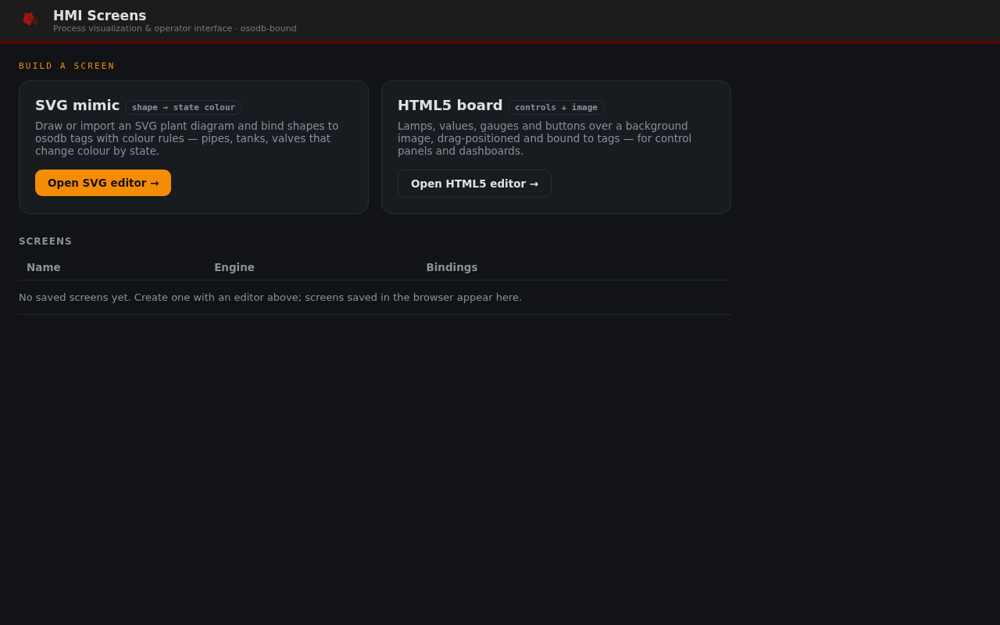

# oso-hmi — Cockpit HMI module

**© 2026 Roig Borrell S.L. · Ibercomp S.L.** · Part of [OSOLogic](https://github.com/OSOlogic/platform) · AGPL-3.0-or-later



A [Cockpit](https://cockpit-project.org/) module to manage the device's **HMI screens** —
so the *Cockpit admin flavour* configures visualization alongside the system. Launch the
SVG or HTML5 editor, and see the screens saved on the device.

## What it does

- **Build a screen** — open the [SVG mimic editor](../../../hmi-web/svg-hmi/) (shape → state
  colour) or the [HTML5 board editor](../../../hmi-web/html5-hmi/) (controls + image).
- **Screens** — lists the HMI screens found on the device (currently browser-stored;
  a server-backed store lands in [`../../api/`](../../api/)).

## Install (Cockpit)

Copy this folder to a Cockpit package path so it appears in the menu:

```bash
sudo cp -r . /usr/share/cockpit/oso-hmi
```

`manifest.json` registers the menu entry (**HMI**). One of two admin flavours — see the
[Webmin-style panel](../../index.html) for the other.

> Prototype — screen management is a foundation; server-side storage, per-screen access
> control and a screen runtime/kiosk come next.
