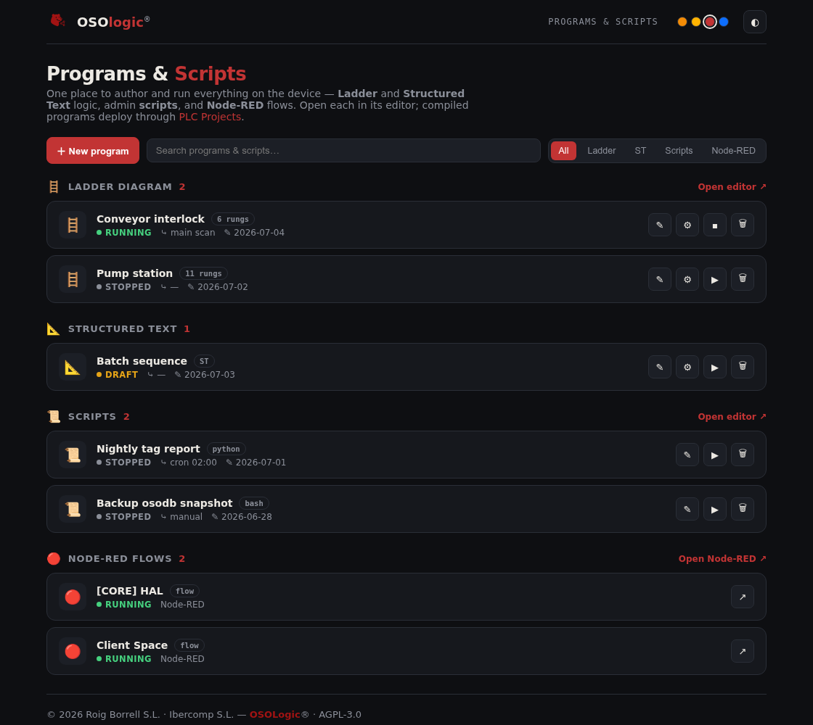

# Programs & Scripts Manager

**© 2026 Roig Borrell S.L. · Ibercomp S.L.** · Part of [OSOLogic](https://github.com/OSOlogic/platform) · AGPL-3.0-or-later

The authoring hub in [osowebmin](../): one place to manage everything runnable on the device and
open each in its editor.

| Group | Editor | Notes |
|-------|--------|-------|
| **Ladder Diagram** | [osoLadder](../../../iec61131/ladder/osoLadder/) | visual LD editor → compiles to ST |
| **Structured Text** | inline editor (here) → [osoST](../../../iec61131/st/osoST/) toolchain | quick edit; full IDE later |
| **Scripts** | [osoAdmin Scripting](../scripting/) | multi-language admin scripts |
| **Node-RED flows** | Node-RED (`:1880`) | flows read live from [`ui/node-red/flows.json`](../../node-red/flows.json) |

Each entry shows **status** (running / stopped / draft) and actions — open, **compile** (Ladder/ST →
ST → p-code), run/stop, delete. Compiled programs are deployed through
[PLC Projects](../cockpit/oso-plc-projects/). "New program" creates the item and jumps to its editor.

> Prototype. The list persists locally; wiring to the runtime (real status, compile, run) and to the
> project store is the next step. Node-RED flows are already read from the repo's `flows.json`.
