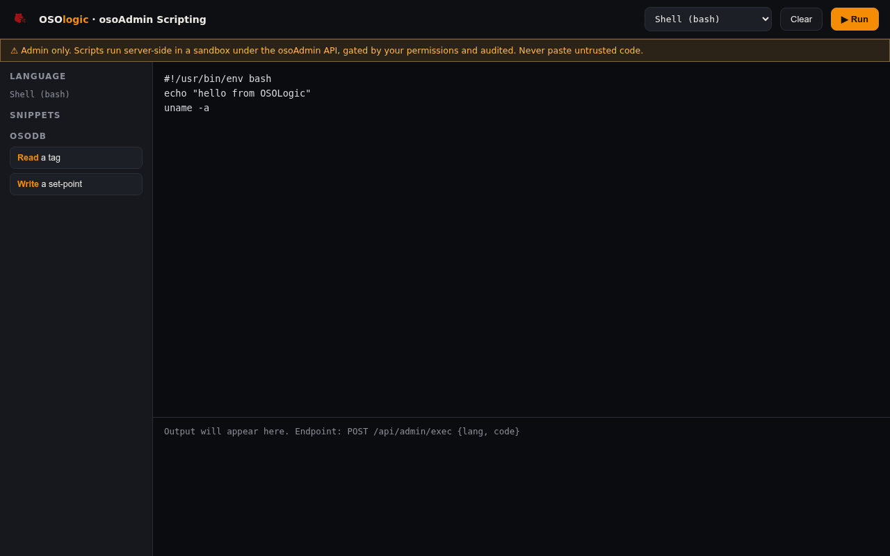

# osoAdmin Scripting

**© 2026 Roig Borrell S.L. · Ibercomp S.L.** · Part of [OSOLogic](https://github.com/OSOlogic/platform) · AGPL-3.0-or-later

A browser scripting console for administration and automation — **multi-language**
("sky is the limit"): shell, Python, Node, PHP, Ruby, Lua, R, C#, Rust, C++, … Pick a
language, write a script, press **Run**; output comes back inline.

## Use

Open `index.html`. Choose a **language** (top-right), edit the script (a hello-world
template loads per language), and **▶ Run**. Snippets include osodb read/write examples.

## How it runs

The UI `POST`s `{ lang, code }` to **`/api/admin/exec`**. That endpoint (to be wired in
[`../api/`](../api/)) executes the script **server-side** and returns
`{ stdout, stderr, code }`.

> ⚠ **Admin only.** Scripts run on the device. The exec endpoint must:
> - require authentication and authorise per user/role,
> - run in a **sandbox** (restricted user, resource + time limits, no host escalation),
> - **audit** every run (who, when, language, code, result).
>
> This UI is the front end; the security lives in the endpoint. Never expose it unauthenticated.

## Files

| File | Role |
|------|------|
| `index.html` | The scripting console (self-contained) |
| `../api/` | Where `/api/admin/exec` is implemented (sandbox + audit) |

> Prototype — the console and language set are in place; the sandboxed exec endpoint
> and audit trail are the next step.
